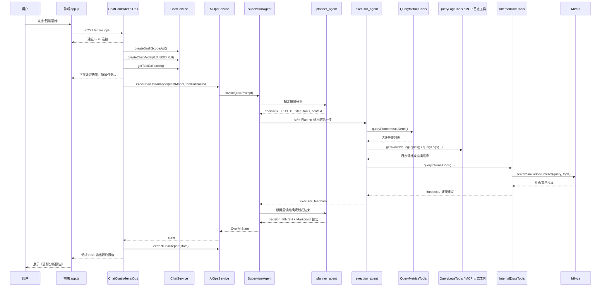

# OpsMind AIOps 告警诊断链路

更新日期：2026-07-09

本文描述 OpsMind 当前实现中的 AIOps 告警诊断链路，范围限定为：

> 用户在前端触发“智能运维”后，后端通过 Supervisor / Planner / Executor 多 Agent 编排，调用 Prometheus 告警、CLS 日志、内部文档 RAG 等工具收集证据，最终通过 SSE 流式返回《告警分析报告》。

这不是 OpsMind 全项目的“典型业务流”。OpsMind 还包含普通聊天、流式聊天、文件上传、文档向量化和 RAG 问答等链路，它们不在本文主线内。

## 1. 链路目标

AIOps 链路面向 OnCall / SRE 场景，目标是把原本需要人工跨系统查询的排障动作收敛到一次自动化诊断中：

1. 查询当前活跃告警。
2. 根据告警定位相关服务、实例、接口或资源。
3. 查询相关日志和事件，补充根因证据。
4. 检索内部运维文档和 Runbook。
5. 汇总生成结构化告警分析报告。
6. 通过 SSE 返回前端展示。

当前实现更适合作为演示和原型链路。默认配置下，Prometheus 和 CLS 数据主要来自 Mock，真实生产接入还不完整。

## 2. 入口与关键代码

| 层次 | 文件 | 关键对象 / 方法 | 职责 |
|---|---|---|---|
| 前端 | `src/main/resources/static/app.js` | `triggerAIOps()` / `sendAIOpsRequest(...)` | 触发 `/api/ai_ops`，读取 SSE 流并更新聊天窗口 |
| API | `src/main/java/org/example/controller/ChatController.java` | `aiOps()` | 创建 SSE、初始化模型和工具、调用 AIOps 服务、流式输出报告 |
| 编排 | `src/main/java/org/example/service/AiOpsService.java` | `executeAiOpsAnalysis(...)` | 构建 Supervisor、Planner、Executor 并执行闭环 |
| 告警工具 | `src/main/java/org/example/agent/tool/QueryMetricsTools.java` | `queryPrometheusAlerts()` | 查询 Prometheus 活跃告警，支持 Mock |
| 日志工具 | `src/main/java/org/example/agent/tool/QueryLogsTools.java` | `getAvailableLogTopics()` / `queryLogs(...)` | 查询日志主题和日志内容，当前真实 CLS 查询尚未实现 |
| 文档工具 | `src/main/java/org/example/agent/tool/InternalDocsTools.java` | `queryInternalDocs(...)` | 通过 RAG 检索内部文档 |
| 时间工具 | `src/main/java/org/example/agent/tool/DateTimeTools.java` | `getCurrentDateTime()` | 提供当前时间 |

## 3. 端到端时序



### 3.1 全链路总览

本节只保留端到端主线，避免和后续章节重复。详细实现分别见 `## 4` 到 `## 13`，Agent 内部状态流转见 `### 6.1`。

完整链路可以压缩为：

```text
前端点击“智能运维”
  -> POST /api/ai_ops
  -> ChatController 建立 SSE 长连接
  -> ChatController 创建 DashScopeChatModel
  -> ChatController 获取 MCP ToolCallback
  -> AiOpsService 创建 Planner / Executor / Supervisor
  -> supervisorAgent.invoke(taskPrompt)
  -> 框架初始化 OverAllState(input, messages)
  -> Supervisor 调度 Planner 生成计划
  -> Planner 写入 planner_plan
  -> Supervisor 调度 Executor 执行计划
  -> Executor 根据 planner_plan 调用工具
  -> 工具返回 Prometheus 告警、日志证据、内部文档等结果
  -> Executor 写入 executor_feedback
  -> Supervisor 继续调度 Planner 再规划或生成最终报告
  -> Planner 最后一轮把 Markdown 报告写入 planner_plan
  -> Supervisor 选择 FINISH，图执行结束
  -> AiOpsService 返回 OverAllState
  -> ChatController 从 planner_plan 提取报告
  -> ChatController 通过 SSE 分块推送给前端
  -> 前端持续追加内容，收到 done 后结束展示
```

关键数据流是：

| 数据 | 来源 | 去向 | 说明 |
|---|---|---|---|
| `taskPrompt` | `AiOpsService` 硬编码 | `supervisorAgent.invoke(...)` | 当前 `/api/ai_ops` 没有请求体，任务描述由后端固定生成。 |
| `input` | Agent Framework | `OverAllState` | 由 `taskPrompt` 初始化。 |
| `messages` | Agent Framework | `OverAllState` | 保存多轮 Agent、模型和工具上下文。 |
| `planner_plan` | `planner_agent` | `OverAllState` | 保存 Planner 最新输出；前期是计划，最后一轮期望是 Markdown 报告。 |
| `executor_feedback` | `executor_agent` | `OverAllState` | 保存 Executor 最新执行反馈。 |
| 最终报告 | Planner 最后一轮输出 | Controller / 前端 | Controller 通过 `extractFinalReport(state)` 从 `planner_plan` 读取。 |

章节阅读对应关系：

| 想看什么 | 对应章节 |
|---|---|
| 前端如何触发 | `## 4. 前端触发` |
| 后端如何建立 SSE、初始化模型和工具 | `## 5. 后端 API 流程` |
| Planner / Executor / Supervisor 如何创建 | `## 6. Agent 编排` |
| Agent 之间如何通过状态传递计划和反馈 | `### 6.1 Supervisor / Planner / Executor 详细状态流转` |
| 本地工具和 MCP 工具如何注入 | `## 7. 工具注入方式` |
| Prometheus 告警如何查询 | `## 8. 告警查询` |
| 日志如何查询 | `## 9. 日志查询` |
| 内部文档如何检索 | `## 10. 内部文档检索` |
| 报告如何生成和提取 | `## 11. 最终报告生成与提取` |
| 报告如何通过 SSE 输出 | `## 12. SSE 输出格式` |
| 当前实现有哪些边界和风险 | `## 13. 当前实现边界` |
## 4. 前端触发

前端的智能运维按钮绑定到 `triggerAIOps()`。点击后会创建一条加载态消息，然后调用：

```javascript
fetch(`${this.apiBaseUrl}/ai_ops`, {
  method: 'POST',
  headers: {
    'Content-Type': 'application/json',
  }
})
```

当前 `/api/ai_ops` 没有请求体，也不接收告警 ID、服务名、时间范围等参数。因此它执行的是“读取当前告警并自动分析”，不是“分析用户指定事故”。

前端使用 `response.body.getReader()` 持续读取后端 SSE 数据，并把内容追加到当前 AIOps 消息中。收到 `done` 类型消息后结束展示。

## 5. 后端 API 流程

入口方法：

```java
@PostMapping(value = "/ai_ops", produces = "text/event-stream;charset=UTF-8")
public SseEmitter aiOps()
```

`ChatController.aiOps()` 的主要步骤是：

1. 创建 10 分钟超时的 `SseEmitter`。
2. 在线程池中异步执行 AIOps 任务。
3. 创建 DashScope API 和 ChatModel。
4. 从 `ChatService.getToolCallbacks()` 获取外部 MCP 工具回调。
5. 发送初始 SSE 消息：`正在读取告警并拆解任务...`。
6. 调用 `AiOpsService.executeAiOpsAnalysis(chatModel, toolCallbacks)`。
7. 从返回的 `OverAllState` 中提取最终报告。
8. 将报告按 50 个字符一段推送给前端。
9. 发送 `SseMessage.done()` 并完成 SSE。

关键实现细节：

```java
SseEmitter emitter = new SseEmitter(600000L);
```

`600000L` 表示这条 SSE 连接最长保持 10 分钟。AIOps 会涉及多轮大模型调用和工具调用，不能按普通短请求处理。

实际分析逻辑会提交到 Controller 内部线程池：

```java
executor.execute(() -> {
    ...
});
```

因此 `aiOps()` 方法会先返回 `SseEmitter` 建立连接，耗时的 Agent 编排在异步线程里继续执行。

外部 MCP 工具通过：

```java
chatService.getToolCallbacks()
```

读取。如果 `ToolCallbackProvider` 没有注入，`ChatService` 会返回空数组：

```java
return new ToolCallback[0];
```

所以当前 AIOps 链路可以在没有 MCP 的情况下运行，本地 method tools 仍然可用。

如果 `executeAiOpsAnalysis(...)` 返回 `Optional.empty()`，Controller 会向前端发送“AI Ops 编排未返回有效结果”，然后结束 SSE。也就是说，`Optional<OverAllState>` 为空被视为编排没有产出有效最终状态。

AIOps 使用的模型参数是：

```java
chatService.createChatModel(dashScopeApi, 0.3, 8000, 0.9)
```

含义：

| 参数 | 当前值 | 作用 |
|---|---:|---|
| `temperature` | `0.3` | 降低随机性，让诊断输出更稳定 |
| `maxToken` | `8000` | 允许生成较长的分析报告 |
| `topP` | `0.9` | 控制采样范围 |

## 6. Agent 编排

核心方法：

```java
AiOpsService.executeAiOpsAnalysis(DashScopeChatModel chatModel, ToolCallback[] toolCallbacks)
```

该方法会构建三个角色：

| Agent | 名称 | 是否直接调用工具 | 输出 key | 职责 |
|---|---|---|---|---|
| Supervisor | `ai_ops_supervisor` | 否 | 框架内部状态 | 调度 Planner / Executor，决定继续执行还是结束 |
| Planner | `planner_agent` | 否 | `planner_plan` | 规划、再规划、最终生成 Markdown 报告 |
| Executor | `executor_agent` | 是 | `executor_feedback` | 执行 Planner 给出的第一步，调用工具并返回证据摘要 |

关键约束：

- Planner 只负责计划和报告，不直接查监控、日志或文档。
- Executor 只执行 Planner 输出中的第一步。
- 工具返回空结果或失败时，必须把失败原因反馈给 Planner。
- 最终报告必须基于工具返回的真实内容，不能编造。
- 如果同一方向连续多次失败，需要在报告中说明无法完成的原因。

### 6.1 Supervisor / Planner / Executor 详细状态流转

本节展开说明一次 `/api/ai_ops` 请求进入 Agent Framework 后，`SupervisorAgent`、`planner_agent`、`executor_agent` 和 `OverAllState` 之间到底如何协作。

#### 6.1.1 初始输入从哪里来

当前 `/api/ai_ops` 接口没有接收前端请求体，也没有接收告警 ID、服务名、时间范围等参数。AIOps 任务的初始输入来自后端硬编码的 `taskPrompt`：

```java
String taskPrompt = "你是企业级 SRE，接到了自动化告警排查任务。请结合工具调用，执行 *规划→执行→再规划* 的闭环，并最终按照固定模板输出《告警分析报告》...";
return supervisorAgent.invoke(taskPrompt);
```

框架收到 `supervisorAgent.invoke(taskPrompt)` 后，会把这个字符串转换为初始状态。可以理解为：

```text
OverAllState.data["input"] = taskPrompt
OverAllState.data["messages"] = [UserMessage(taskPrompt)]
```

这里的 `messages` 不是前端聊天窗口里的用户输入，而是框架把 `taskPrompt` 包装成的一条用户任务消息。后续 Planner、Executor、工具调用结果和模型回复都会继续进入消息上下文，供 Supervisor 下一轮路由判断使用。

#### 6.1.2 Supervisor 是怎么决定下一步的

`SupervisorAgent` 本质上是一个由大模型驱动的路由器。你们的代码把三类材料交给框架：

```java
SupervisorAgent.builder()
    .name("ai_ops_supervisor")
    .model(chatModel)
    .systemPrompt(buildSupervisorSystemPrompt())
    .subAgents(List.of(plannerAgent, executorAgent))
    .build();
```

框架内部会使用这些材料构造 Supervisor 路由请求：

- `chatModel`：用来做路由判断的大模型。
- `buildSupervisorSystemPrompt()`：你们写的 Supervisor 业务规则。
- `subAgents`：候选 Agent 列表，包括 `planner_agent` 和 `executor_agent`。
- `messages`：当前执行上下文，来自 `OverAllState` 中持续维护的消息历史。
- `FINISH`：框架为 Supervisor 流程提供的结束选项。

因此 Supervisor 每轮不是执行 Java `if/else`，而是让大模型在以下候选项里选择一个：

```text
planner_agent
executor_agent
FINISH
```

如果模型选择 `planner_agent`，框架调用 Planner 子图；如果选择 `executor_agent`，框架调用 Executor 子图；如果选择 `FINISH`，框架走到结束节点 `__END__`，`supervisorAgent.invoke(...)` 返回最终 `OverAllState`。

#### 6.1.3 第一次为什么通常会调 Planner

第一次进入 Supervisor 时，状态里只有任务输入，还没有排查计划，也没有工具证据。按你们的 Supervisor prompt，合理的下一步是先让 Planner 拆解任务，所以通常会选择：

```text
planner_agent
```

但这不是硬编码保证。当前实现没有写类似下面的 Java 逻辑：

```java
if (state.value("planner_plan").isEmpty()) {
    return "planner_agent";
}
```

第一次调 Planner 只是由 Supervisor 的大模型根据 prompt 和上下文判断出来的结果。理论上，如果模型误判，也可能提前选择 `executor_agent` 或 `FINISH`。

#### 6.1.4 Planner 执行后写入什么

Planner 由以下代码构建：

```java
ReactAgent.builder()
    .name("planner_agent")
    .description("负责拆解告警、规划与再规划步骤")
    .model(chatModel)
    .systemPrompt(buildPlannerSystemPrompt())
    .instruction(buildPlannerInstruction())
    .outputKey("planner_plan")
    .build();
```

关键是：

```java
.outputKey("planner_plan")
```

这表示 Planner 每次执行结束后，框架会把 Planner 的最终模型回复写入：

```text
OverAllState.data["planner_plan"]
```

这个 value 的实际类型通常是 `AssistantMessage`，不是普通 `String`。所以提取报告时会这样写：

```java
state.value("planner_plan")
    .filter(AssistantMessage.class::isInstance)
    .map(AssistantMessage.class::cast)
```

`planner_plan` 这个 key 的名字容易误导。它并不保证永远只保存“计划”，它保存的是 Planner 最新一次输出：

```text
第 1 次 Planner 输出：排查计划 JSON
第 2 次 Planner 输出：再规划 JSON
第 N 次 Planner 输出：最终 Markdown 报告
```

默认策略是覆盖写入，因此后一次 Planner 输出会覆盖前一次 `planner_plan`。如果最后一次 Planner 按 prompt 生成了 Markdown 报告，那么 `planner_plan.getText()` 就会变成最终报告正文。

#### 6.1.5 Planner 的 `decision=EXECUTE` / `decision=FINISH` 是什么

`decision=EXECUTE` 和 `decision=FINISH` 不是框架内置 enum，也不是 Java 代码解析的强类型字段。它们只是 Planner prompt 中约定的文本协议。

当 Planner 判断还需要继续查证据时，prompt 要求它输出类似：

```json
{
  "decision": "EXECUTE",
  "step": "查询当前 Prometheus 活跃告警",
  "tools": ["queryPrometheusAlerts"],
  "context": "先确认当前有哪些活跃告警"
}
```

这条输出会被写入 `planner_plan`，并进入消息上下文。随后 Supervisor 读到上下文后，通常会选择 `executor_agent`。

当 Planner 判断证据足够时，prompt 要求它进入 `FINISH` 模式，但又明确要求不要输出 JSON，而是直接输出完整 Markdown 报告：

```markdown
# 告警分析报告

---

## 活跃告警清单
...
```

所以 Planner 的 `decision=FINISH` 更准确地说是“提示词中的业务语义”：告诉模型在完成时切换到报告输出模式。真正让图结束的是 Supervisor 大模型返回的 `FINISH` 路由结果。

#### 6.1.6 Executor 如何拿到 Planner 的计划

Executor 由以下代码构建：

```java
ReactAgent.builder()
    .name("executor_agent")
    .description("负责执行 Planner 的首个步骤并及时反馈")
    .model(chatModel)
    .systemPrompt(buildExecutorSystemPrompt())
    .instruction(buildExecutorInstruction())
    .methodTools(buildMethodToolsArray())
    .tools(toolCallbacks)
    .outputKey("executor_feedback")
    .build();
```

Executor 的 instruction 中显式引用了：

```text
{planner_plan}
```

可以理解为：

```text
Planner 最新输出如下：

{planner_plan}

请只执行 Planner 输出中的第一步。执行完成后，以 JSON 形式返回...
```

框架在调用 Executor 前，会用 `OverAllState` 渲染这个模板变量。也就是说：

```text
{planner_plan}
```

会被替换成当前状态里的：

```text
OverAllState.data["planner_plan"]
```

因此 Executor 能看到 Planner 最新一次给出的计划，然后根据计划选择本地 method tools 或 MCP tools 进行查询。

#### 6.1.7 Executor 执行后写入什么

Executor 每次执行完成后，框架会把它的最终回复写入：

```text
OverAllState.data["executor_feedback"]
```

因为 Executor 配置了：

```java
.outputKey("executor_feedback")
```

典型反馈内容会类似：

```json
{
  "status": "SUCCESS",
  "executedStep": "查询当前 Prometheus 活跃告警",
  "evidence": "发现 HighCPUUsage、HighMemoryUsage、SlowResponse 等活跃告警...",
  "failedReason": "",
  "nextHint": "建议继续查询相关服务日志和内部 Runbook"
}
```

如果工具失败，则应该返回：

```json
{
  "status": "FAILED",
  "executedStep": "查询 CLS 应用日志",
  "evidence": "",
  "failedReason": "CLS 真实查询尚未实现或返回空结果",
  "nextHint": "建议停止该方向，转向已有 Prometheus 告警和内部文档证据"
}
```

`executor_feedback` 默认也是覆盖策略。也就是说，状态 key 本身只稳定保存最新一次 Executor 反馈：

```text
第 1 次 executor_feedback -> 写入
第 2 次 executor_feedback -> 覆盖第 1 次
第 3 次 executor_feedback -> 覆盖第 2 次
```

多轮历史证据主要依赖 `messages` 上下文保留，而不是依赖 `executor_feedback` 这个单一 key 保留所有版本。

#### 6.1.8 Planner 如何拿到 Executor 的结果

当前 Planner 的 instruction 没有显式写：

```text
{executor_feedback}
```

它主要通过消息历史理解 Executor 上一轮或多轮执行结果。也就是说，Executor 的输出会进入框架维护的 `messages`，Supervisor 再次调度 Planner 时，Planner 能从上下文中看到之前的执行结果。

当前机制可以理解为：

```text
Executor 输出 -> 写入 executor_feedback
Executor 输出 -> 进入 messages
Supervisor 再次选择 planner_agent
Planner 从 messages 中看到 Executor 反馈
Planner 继续规划或生成报告
```

这种方式能保留多轮上下文，但不够结构化，也依赖框架消息维护、上下文窗口长度和模型理解能力。

更明确的做法是把最新反馈显式注入 Planner instruction：

```text
Executor 最新反馈如下：

{executor_feedback}
```

如果希望 Planner 稳定看到所有历史执行结果，更推荐新增一个追加型状态 key，例如：

```text
executor_feedback_history
```

并配置追加策略，让每轮 Executor 反馈都追加进去。这样 Planner 可以同时读取：

```text
最新执行反馈：{executor_feedback}
历史执行反馈：{executor_feedback_history}
```

当前实现没有这个历史 key，因此最终报告主要依赖 `messages` 中累计的上下文和最新状态。

#### 6.1.9 循环是怎样形成的

Supervisor 图的流转不是 Planner 和 Executor 自己互相调用，而是每个子 Agent 执行完都回到 Supervisor：

```text
Supervisor
  -> planner_agent
  -> Supervisor
  -> executor_agent
  -> Supervisor
  -> planner_agent
  -> Supervisor
  -> ...
```

可以按轮次理解：

```text
第 0 轮：
  input = taskPrompt
  messages = [UserMessage(taskPrompt)]
  Supervisor 判断下一步，一般选择 planner_agent

第 1 轮：
  Planner 输出排查计划
  planner_plan = AssistantMessage(JSON 计划)
  messages 追加 Planner 输出
  回到 Supervisor

第 2 轮：
  Supervisor 判断已有计划，需要执行
  选择 executor_agent

第 3 轮：
  Executor 读取 {planner_plan}
  Executor 调用工具
  executor_feedback = AssistantMessage(JSON 执行反馈)
  messages 追加 Executor 输出和工具结果
  回到 Supervisor

第 4 轮：
  Supervisor 判断需要再规划
  选择 planner_agent

第 5 轮：
  Planner 结合历史反馈继续规划
  planner_plan = AssistantMessage(JSON 再规划)
  回到 Supervisor

第 N 轮：
  Planner 判断证据足够
  planner_plan = AssistantMessage(Markdown 告警分析报告)
  回到 Supervisor

第 N+1 轮：
  Supervisor 判断任务完成
  选择 FINISH
  图结束，返回 OverAllState
```

#### 6.1.10 最终报告什么时候生成

最终报告不是在 Supervisor 选择 `FINISH` 后生成的。顺序是：

```text
Planner 最后一次执行时生成 Markdown 报告
  -> 框架写入 OverAllState["planner_plan"]
  -> 回到 Supervisor
  -> Supervisor 判断可以 FINISH
  -> 图结束
  -> Controller 从 planner_plan 读取报告
  -> SSE 输出给前端
```

一旦 Supervisor 选择 `FINISH`，框架会进入结束节点，不会再调用 Planner。因此报告必须在 `FINISH` 之前已经由 Planner 写入 `planner_plan`。

当前 Controller 读取报告的代码是：

```java
Optional<String> finalReportOptional = aiOpsService.extractFinalReport(state);
```

而 `extractFinalReport(...)` 的核心是：

```java
state.value("planner_plan")
    .filter(AssistantMessage.class::isInstance)
    .map(AssistantMessage.class::cast)
    .map(AssistantMessage::getText)
```

这意味着当前实现假设：

```text
流程正常结束时，planner_plan 的最新内容就是 Markdown 最终报告。
```

如果 Supervisor 过早选择 `FINISH`，或者 Planner 最后一次输出仍然是 JSON 计划，那么这里拿到的就不是最终报告。

#### 6.1.11 关键状态表

| 状态 key | 来源 | 写入时机 | 默认语义 | 是否保存历史 |
|---|---|---|---|---|
| `input` | 框架由 `taskPrompt` 初始化 | `supervisorAgent.invoke(taskPrompt)` 开始时 | 原始 AIOps 任务描述 | 否 |
| `messages` | 框架维护 | 每轮 Agent / 工具交互后 | 多轮上下文消息 | 是，受上下文和框架策略影响 |
| `planner_plan` | `planner_agent` 的 `outputKey` | 每次 Planner 执行完成后 | Planner 最新输出；前期是计划，最后可能是报告 | 否，默认覆盖 |
| `executor_feedback` | `executor_agent` 的 `outputKey` | 每次 Executor 执行完成后 | Executor 最新执行结果 | 否，默认覆盖 |

#### 6.1.12 当前设计的几个重要结论

- Planner 和 Executor 不会自动轮流执行，必须由 Supervisor 每轮调度。
- Supervisor 的调度判断由大模型完成，不是 Java 规则硬判断。
- Planner 的 `decision=EXECUTE` / `decision=FINISH` 是提示词约定，不是框架内置状态机。
- Executor 能执行 Planner 计划，是因为它的 instruction 显式引用 `{planner_plan}`。
- Planner 能生成最终报告，是因为 Planner prompt 规定它在证据足够时直接输出 Markdown 报告。
- 最终报告必须在 Supervisor `FINISH` 之前生成，因为 `FINISH` 之后不会再执行任何 Agent。
- 当前报告提取逻辑强依赖 `planner_plan` 的最新值是 Markdown 报告，这个约定比较脆弱。

#### 6.1.13 更稳的改进方向

当前实现偏 prompt 驱动，适合原型和演示。生产化时可以考虑把关键状态从自然语言约定改成结构化状态：

```text
active_alerts
metrics_evidence
log_evidence
runbook_evidence
executor_feedback_history
final_report
```

并把路由从纯 LLM 判断改成部分代码规则，例如：

```text
如果没有 planner_plan -> 强制调 planner_agent
如果 planner_plan.decision == EXECUTE -> 强制调 executor_agent
如果 executor_feedback.status 已返回 -> 强制调 planner_agent
如果 final_report 已生成 -> FINISH
```

这样可以降低 Supervisor 误判、提前结束、报告未生成等风险。

## 7. 工具注入方式

Executor 同时接收两类工具：

```java
.methodTools(buildMethodToolsArray())
.tools(toolCallbacks)
```

### 7.1 本地 Java 方法工具

`buildMethodToolsArray()` 返回本地 `@Tool` 工具对象：

- `DateTimeTools`：查询当前日期和时间
- `InternalDocsTools`：检索内部知识库
- `QueryMetricsTools`：通过 Prometheus 查询活跃告警信息
- `QueryLogsTools`：根据 Prometheus 查询到的活跃告警信息，查询对应服务的日志信息

注意：当前 `QueryLogsTools` 是 `@Component`，正常情况下会和 `QueryMetricsTools` 一样被注入。代码里对 `QueryLogsTools` 使用 `@Autowired(required = false)` 更像是防御性/历史设计：如果未来生产环境移除本地日志工具、完全改由 MCP 提供日志能力，服务仍能启动。就当前代码而言，它会根据 `cls.mock-enabled` 返回 Mock 日志，或在真实模式下提示 CLS 查询尚未实现。

### 7.2 外部 MCP 工具

`ChatService.getToolCallbacks()` 从可选的 `ToolCallbackProvider` 中读取外部 MCP 工具。

如果没有启用 MCP，返回空数组：

```java
return new ToolCallback[0];
```

因此，当前 AIOps 链路不强依赖 MCP；但如果生产环境把日志、CMDB、发布系统等能力接到 MCP，Executor 可以通过 `.tools(toolCallbacks)` 调用它们。

## 8. 告警查询

工具方法：

```java
QueryMetricsTools.queryPrometheusAlerts()
```

配置项：

```yaml
prometheus:
  base-url: http://localhost:9090
  timeout: 10
  mock-enabled: true
```

行为：

| 模式 | 行为 |
|---|---|
| `mock-enabled: true` | 返回内置模拟告警：`HighCPUUsage`、`HighMemoryUsage`、`SlowResponse` |
| `mock-enabled: false` | 请求 `${prometheus.base-url}/api/v1/alerts` 并解析 Prometheus 返回 |

Mock 告警会包含告警名称、描述、状态、触发时间和持续时间，用于演示完整诊断流程。

## 9. 日志查询

工具方法：

```java
QueryLogsTools.getAvailableLogTopics()
QueryLogsTools.queryLogs(region, logTopic, query, limit)
```

内置日志主题：

| 日志主题 | 用途 | 关联告警 |
|---|---|---|
| `system-metrics` | CPU、内存、磁盘等资源日志 | `HighCPUUsage`、`HighMemoryUsage`、`HighDiskUsage` |
| `application-logs` | 应用错误、慢请求、下游依赖日志 | `ServiceUnavailable`、`SlowResponse`、`HighMemoryUsage` |
| `database-slow-query` | 数据库慢查询日志 | `SlowResponse`、`ServiceUnavailable` |
| `system-events` | Pod 重启、OOM Kill、容器崩溃等事件 | `ServiceUnavailable`、`HighMemoryUsage` |

配置项：

```yaml
cls:
  mock-enabled: true
```

当前行为：

| 模式 | 行为 |
|---|---|
| `mock-enabled: true` | 根据日志主题和查询条件返回内置模拟日志 |
| `mock-enabled: false` | 返回错误提示：`CLS 真实查询尚未实现，请启用 mock 模式进行测试` |

所以当前报告中的日志证据在默认演示环境下来自 Mock 数据。真实 CLS API 接入仍是后续工作。

## 10. 内部文档检索

工具方法：

```java
InternalDocsTools.queryInternalDocs(query)
```

调用链路：

```text
Agent 查询词
  -> InternalDocsTools.queryInternalDocs(...)
  -> VectorSearchService.searchSimilarDocuments(query, topK)
  -> Milvus 相似向量检索
  -> 返回 SearchResult 列表
  -> Agent 整理为处理建议 / Runbook 引用
```

配置项：

```yaml
rag:
  top-k: 3
```

项目内置运维文档目录：

```text
aiops-docs/
```

示例文档包括：

- `cpu_high_usage.md`
- `memory_high_usage.md`
- `disk_high_usage.md`
- `service_unavailable.md`
- `slow_response.md`

这些文档需要先完成上传、切片、向量化并写入 Milvus，AIOps 才能通过 RAG 检索到有效内容。

## 11. 最终报告生成与提取

Planner 在 `decision=FINISH` 时必须直接输出 Markdown 报告，而不是 JSON。

报告模板包含：

- 活跃告警清单
- 告警根因分析
- 告警详情
- 症状描述
- 日志证据
- 根因结论
- 已执行排查步骤
- 处理建议
- 预期效果
- 整体评估
- 关键发现
- 后续建议
- 风险评估

后端通过以下方式提取最终报告：

```java
state.value("planner_plan")
    .filter(AssistantMessage.class::isInstance)
    .map(AssistantMessage.class::cast)
```

如果 `planner_plan` 中存在 `AssistantMessage`，其文本会被视为最终报告。否则接口会返回：

```text
AI Ops 流程已完成，但未生成最终报告。
```

这意味着最终报告强依赖 Planner 最后一轮输出被写入 `planner_plan`。如果框架状态结构变化，或最终答案只存在于 Supervisor 输出中，当前提取逻辑可能拿不到报告。

## 12. SSE 输出格式

后端先输出分隔符和标题：

```text
============================================================
告警分析报告
```

然后按 50 个字符切片发送：

```java
int chunkSize = 50;
for (int i = 0; i < finalReportText.length(); i += chunkSize) {
    int end = Math.min(i + chunkSize, finalReportText.length());
    emitter.send(SseEmitter.event()
        .name("message")
        .data(SseMessage.content(finalReportText.substring(i, end)), MediaType.APPLICATION_JSON));
}
```

最后发送：

```java
SseMessage.done()
```

所有 SSE 数据都通过 `SseMessage` 包装，事件名是 `message`。前端持续拼接 `content` 类型消息并刷新当前 AIOps 消息；收到 `done` 后结束 loading 状态。

如果后端发送 SSE 过程中客户端断开，`SseEmitter` 可能抛出异常。Controller 会调用 `completeWithErrorQuietly(...)` 尝试结束连接，并忽略 emitter 已经完成时的 `IllegalStateException`。

## 13. 当前实现边界

### 13.1 `/api/ai_ops` 无入参

当前无法指定：

- 告警 ID
- 服务名
- 实例名
- 时间范围
- 日志主题
- 事故上下文

因此它只能做“当前告警自动诊断”，不能精确复盘某个指定事故。

### 13.2 Prometheus 默认可能是 Mock

如果 `prometheus.mock-enabled: true`，报告中的告警来自内置模拟数据，不代表真实监控状态。

### 13.3 CLS 真实查询尚未实现

如果 `cls.mock-enabled: false`，`queryLogs(...)` 不会调用真实 CLS API，而是返回未实现提示。

### 13.4 工具调用过程未持久化

当前没有把以下信息落库：

- 每轮 Planner 输出
- 每轮 Executor 反馈
- 工具名称和参数
- 工具原始返回
- 报告生成版本

这对生产审计、事故复盘和报告可追溯性不够。

### 13.5 报告提取依赖 `planner_plan`

后端只从 `planner_plan` 提取报告。如果未来调整 Agent 输出 key 或 Supervisor 接管最终输出，需要同步修改 `extractFinalReport(...)`。

### 13.6 Controller 使用本地内存和线程池

`ChatController` 使用 `Executors.newCachedThreadPool()` 执行异步任务。生产环境需要关注并发上限、超时、模型调用失败、客户端断连和线程资源回收。

### 13.7 异常路径主要通过 SSE 返回

当前 AIOps 链路的异常不一定表现为 HTTP 非 200。多数情况下，Controller 会在 SSE 中返回错误消息：

- `executeAiOpsAnalysis(...)` 抛异常：返回 `AI Ops 流程失败: ...`。
- `supervisorAgent.invoke(...)` 返回空 Optional：返回“编排未返回有效结果”。
- `extractFinalReport(...)` 拿不到 `planner_plan`：返回“流程已完成，但未生成最终报告”。
- SSE 发送失败或客户端断连：尝试 `completeWithErrorQuietly(...)` 结束连接。
- 工具调用失败：理想情况下由 Executor 写入 `executor_feedback`，再由 Planner 在最终报告中说明失败原因。

因此工具失败不一定会中断整条 HTTP 请求。只要 Agent 图还能继续运行，失败信息应该成为诊断报告的一部分。

## 14. 一句话总结

当前 AIOps 告警诊断链路是：

> 前端调用 `/api/ai_ops` 建立 SSE，后端创建 DashScope 模型和 Agent 工具，由 Supervisor 调度 Planner / Executor 闭环执行；Executor 查询 Prometheus、日志和内部文档，Planner 根据证据生成 Markdown 告警分析报告，最后由 Controller 分块流式返回前端。

## 15. 读代码建议顺序

1. `src/main/resources/static/app.js`
2. `src/main/java/org/example/controller/ChatController.java`
3. `src/main/java/org/example/service/AiOpsService.java`
4. `src/main/java/org/example/service/ChatService.java`
5. `src/main/java/org/example/agent/tool/QueryMetricsTools.java`
6. `src/main/java/org/example/agent/tool/QueryLogsTools.java`
7. `src/main/java/org/example/agent/tool/InternalDocsTools.java`
8. `src/main/java/org/example/service/VectorSearchService.java`
9. `src/main/java/org/example/service/VectorIndexService.java`

## 16. 后续可补充文档

建议后续把以下链路单独拆成文档：

- 普通聊天链路：`/api/chat`
- 流式聊天链路：`/api/chat_stream`
- 文件上传和向量化链路：`/api/upload -> Milvus`
- 内部文档 RAG 查询链路：`queryInternalDocs -> VectorSearchService`
- MCP 外部工具接入链路
- 聊天会话管理、Milvus 健康检查（这两个较简单）
