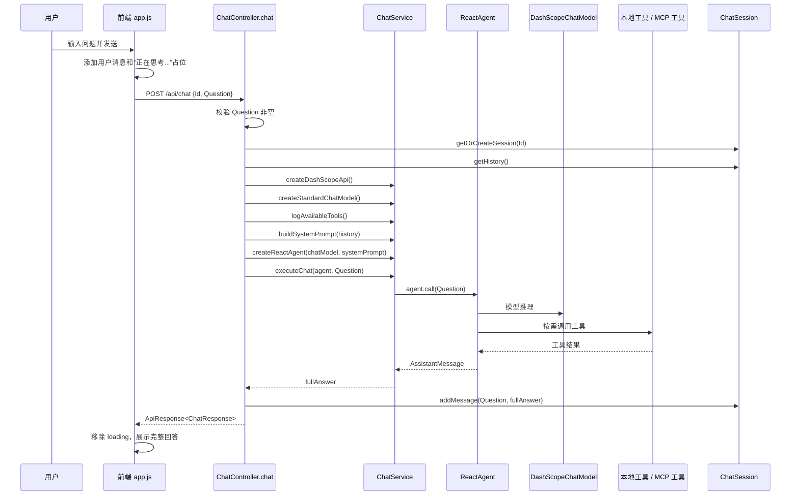

# OpsMind 普通聊天链路

更新时间：2026-07-09

本文描述 OpsMind 当前实现中的普通聊天链路，范围限定为：

> 前端在“快速/普通对话”模式下调用 `POST /api/chat`，后端创建 DashScope 模型和 `ReactAgent`，结合内存会话历史与工具能力执行一次阻塞式问答，最终一次性返回完整回答。

它不同于：

- `/api/chat_stream`：流式聊天链路，按模型增量输出实时推送。
- `/api/ai_ops`：AIOps 多 Agent 告警诊断链路。
- `/api/upload -> Milvus`：文件上传和向量化链路。

## 1. 链路目标

普通聊天链路面向通用智能运维问答场景，目标是让用户以同步请求方式获得一次完整回答。

它支持：

1. 普通自然语言问答。
2. 基于会话历史的上下文回答。
3. 查询当前时间。
4. 检索内部知识库。
5. 查询 Prometheus 活跃告警信息。
6. 通过 MCP 或本地工具查询外部能力，例如日志。

普通聊天链路是阻塞式的：后端会等 `ReactAgent.call(...)` 完成后，再一次性返回完整响应。

## 2. 入口与关键代码

| 层次 | 文件 | 关键对象 / 方法 | 职责 |
|---|---|---|---|
| 前端 | `src/main/resources/static/app.js` | `sendQuickMessage(message)` | 调用 `/api/chat`，等待 JSON 响应并展示回答 |
| API | `src/main/java/org/example/controller/ChatController.java` | `chat(@RequestBody ChatRequest request)` | 校验请求、创建模型、创建 Agent、更新会话历史 |
| 服务 | `src/main/java/org/example/service/ChatService.java` | `createStandardChatModel(...)` | 创建普通聊天模型 |
| 服务 | `src/main/java/org/example/service/ChatService.java` | `buildSystemPrompt(history)` | 构造包含工具说明和历史消息的系统提示词 |
| 服务 | `src/main/java/org/example/service/ChatService.java` | `createReactAgent(...)` | 注入本地工具和 MCP 工具，创建 `ReactAgent` |
| 服务 | `src/main/java/org/example/service/ChatService.java` | `executeChat(agent, question)` | 调用 `agent.call(question)` 并返回完整文本 |
| 会话 | `src/main/java/org/example/domain/po/ChatSession.java` | `addMessage(...)` / `getHistory()` | 在内存中保存最近多轮对话 |

## 3. 端到端时序



### 3.1 完整链路压缩版

本节只保留普通聊天端到端主线，避免和后续章节重复。详细实现分别见 `## 4` 到后续章节。

完整链路可以压缩为：

```text
前端发送普通聊天消息
    -> sendQuickMessage(message)
    -> 前端添加用户消息和“正在思考...”loading
    -> POST /api/chat，提交 Id 和 Question
    -> ChatController.chat 接收 ChatRequest
    -> ChatController 校验 Question 非空
    -> ChatController 根据 Id 获取或创建 ChatSession
    -> ChatController 读取当前会话历史 history
    -> ChatService 创建 DashScopeApi
    -> ChatService 创建普通 DashScopeChatModel
    -> ChatService 读取本地工具和 MCP 工具
    -> ChatService 根据 history 构造 systemPrompt
    -> ChatService 创建 ReactAgent
    -> ChatService.executeChat(agent, question)
    -> ReactAgent.call(question) 阻塞式执行
    -> 大模型根据 systemPrompt、用户问题和历史消息推理
    -> ReactAgent 按需调用 DateTimeTools / InternalDocsTools / QueryMetricsTools / QueryLogsTools / MCP 工具
    -> 工具返回结果给 ReactAgent
    -> ReactAgent 汇总生成 AssistantMessage
    -> ChatService 提取 AssistantMessage 文本
    -> ChatController 把用户问题和完整回答写入 ChatSession
    -> ChatController 返回 ApiResponse<ChatResponse>
    -> 前端移除 loading
    -> 前端一次性展示完整回答
```

## 4. 前端触发

普通聊天由 `sendQuickMessage(message)` 触发。前端先创建一条 loading 消息：

```javascript
const loadingMessage = this.addLoadingMessage('正在思考...');
```

然后调用：

```javascript
fetch(`${this.apiBaseUrl}/chat`, {
  method: 'POST',
  headers: {
    'Content-Type': 'application/json',
  },
  body: JSON.stringify({
    Id: this.sessionId,
    Question: message
  })
})
```

请求体字段是：

| 字段 | 含义 |
|---|---|
| `Id` | 当前前端会话 ID |
| `Question` | 用户输入的问题 |

后端 DTO `ChatRequest` 通过 `@JsonProperty` 和 `@JsonAlias` 兼容多种字段名：

```java
@JsonProperty("Id")
@JsonAlias({"id", "ID"})
private String id;

@JsonProperty("Question")
@JsonAlias({"question", "QUESTION"})
private String question;
```

因此前端传 `Id` / `Question`，后端可以映射到 `id` / `question`。

## 5. 后端 API 流程

普通聊天入口是：

```java
@PostMapping("/chat")
public ResponseEntity<ApiResponse<ChatResponse>> chat(@RequestBody ChatRequest request)
```

主要步骤：

1. 记录请求日志。
2. 校验 `request.getQuestion()` 非空。
3. 根据 `request.getId()` 获取或创建 `ChatSession`。
4. 从 `ChatSession` 获取历史消息。
5. 创建 DashScope API。
6. 创建普通聊天模型。
7. 记录当前可用 MCP 工具。
8. 根据历史消息构建系统提示词。
9. 创建 `ReactAgent`。
10. 调用 `chatService.executeChat(agent, question)`。
11. 把用户问题和模型回答写入会话历史。
12. 返回 `ApiResponse.success(ChatResponse.success(fullAnswer))`。

如果问题为空，直接返回：

```java
ApiResponse.success(ChatResponse.error("问题内容不能为空"))
```

注意这里 HTTP 层仍然返回 200，业务失败被封装在 `ChatResponse.success=false` 和 `errorMessage` 中。

如果执行过程中抛异常，也会返回：

```java
ApiResponse.success(ChatResponse.error(e.getMessage()))
```

也就是说，普通聊天链路多数错误也是业务响应，不一定表现为 HTTP 非 200。

## 6. 会话历史管理

Controller 内部使用内存 Map 保存会话：

```java
private final Map<String, ChatSession> sessions = new ConcurrentHashMap<>();
```

获取或创建会话的逻辑是：

```java
private ChatSession getOrCreateSession(String sessionId) {
    if (sessionId == null || sessionId.isEmpty()) {
        sessionId = UUID.randomUUID().toString();
    }
    return sessions.computeIfAbsent(sessionId, ChatSession::new);
}
```

如果请求没有传 sessionId，后端会生成一个 UUID。但当前 `/api/chat` 响应没有把新生成的 sessionId 返回给前端，因此前端通常需要自己维护 `this.sessionId`。

`ChatSession` 保存 user / assistant 成对消息：

```java
session.addMessage(request.getQuestion(), fullAnswer);
```

默认只保留最近 6 轮问答：

```java
public static final int DEFAULT_MAX_WINDOW_SIZE = 6;
```

超过窗口后会裁剪最旧消息，避免历史无限增长导致 prompt 过长。

会话历史例子：

```json
{
  // 会话 1：用户正在针对 payment-service 告警与 Agent 互动
  "session-9b1deb4d-3b7d-4bad": {
    "sessionId": "session-9b1deb4d-3b7d-4bad",
    "createTime": 1783584000000,       // 会话创建的时间戳 (毫秒)
    "maxWindowSize": 6,                // 限制最多只保留 6 对 (12 条) 对话，超出时旧的会被顶替
    "messageHistory": [
      {
        "role": "user",
        "content": "系统触发了 payment-service 的 HighCPUUsage 告警，请分析下。"
      },
      {
        "role": "assistant",
        "content": "收到，我将调用系统诊断链路对 payment-service 进行排查...\n\n============================================================\n告警分析报告\n\n- **异常服务**: `payment-service`\n- **根因分析**: CPU 使用率持续达到 92%...\n============================================================\n"
      },
      {
        "role": "user",
        "content": "现在需要怎么紧急处理？"
      },
      {
        "role": "assistant",
        "content": "已在知识库中检索到相关 Runbook 建议：\n1. 登录该 Pod 确认是否有死循环线程。\n2. 若流量突增导致，建议执行 Pod 扩容指令 `kubectl scale deployment payment-service --replicas=3`。"
      }
    ]
  },

  // 会话 2：另一个用户的普通聊天会话
  "session-f3a123e4-5678-abcd": {
    "sessionId": "session-f3a123e4-5678-abcd",
    "createTime": 1783584060000,
    "maxWindowSize": 6,
    "messageHistory": [
      {
        "role": "user",
        "content": "你好，你是谁？"
      },
      {
        "role": "assistant",
        "content": "您好！我是 OpsMind 智能 OnCall 助手。我可以为您排查系统告警、查询日志、以及检索内部运维文档。"
      }
    ]
  }
}
```


## 7. 模型创建

普通聊天使用标准模型配置：

```java
DashScopeChatModel chatModel = chatService.createStandardChatModel(dashScopeApi);
```

内部等价于：

```java
createChatModel(dashScopeApi, 0.7, 2000, 0.9)
```

参数含义：

| 参数 | 当前值 | 作用 |
|---|---:|---|
| `temperature` | `0.7` | 普通问答允许更自然的表达和一定随机性 |
| `maxToken` | `2000` | 控制单次回答长度上限 |
| `topP` | `0.9` | 控制候选 token 采样范围 |

相比 AIOps 链路的 `temperature=0.3`、`maxToken=8000`，普通聊天更偏向轻量问答，而不是长报告生成。

## 8. 系统提示词构建

`ChatService.buildSystemPrompt(history)` 会构造一段完整系统提示词，包含三部分。

第一部分是助手角色说明：

```text
你是 OpsMind 智能运维助手，一个专业的企业智能运维助手...
```

第二部分是工具使用说明：

```text
当用户询问时间相关问题时，使用 getCurrentDateTime 工具。
当用户需要查询公司内部文档、流程、最佳实践或技术指南时，使用 queryInternalDocs 工具。
当用户需要查询 Prometheus 告警、监控指标或系统告警状态时，使用 queryPrometheusAlerts 工具。
当用户需要查询腾讯云日志时，请调用腾讯云mcp服务查询...
```

第三部分是历史消息：

```text
--- 对话历史 ---
用户: ...
助手: ...
--- 对话历史结束 ---

请基于以上对话历史，回答用户的新问题。
```

这里的历史不是作为 Spring AI `Message` 列表传入模型，而是被拼接进 system prompt 字符串。优点是实现简单，缺点是历史变长后需要注意上下文窗口和 prompt 膨胀。

## 9. 工具注入

普通聊天创建 `ReactAgent` 的代码是：

```java
ReactAgent.builder()
    .name("opsmind_assistant")
    .model(chatModel)
    .systemPrompt(systemPrompt)
    .methodTools(buildMethodToolsArray())
    .tools(getToolCallbacks())
    .build();
```

工具分两类。

### 9.1 本地 method tools

`buildMethodToolsArray()` 返回本地 Java `@Tool` 工具对象：

- `DateTimeTools`：查询当前日期和时间。
- `InternalDocsTools`：检索内部知识库。
- `QueryMetricsTools`：通过 Prometheus 查询活跃告警信息。
- `QueryLogsTools`：根据告警或用户需求查询对应服务日志信息。

当前 `QueryLogsTools` 是 `@Component`，正常会被注入；它根据 `cls.mock-enabled` 决定走模拟日志还是真实 CLS 查询入口。

### 9.2 MCP tools

`getToolCallbacks()` 从可选的 `ToolCallbackProvider` 中获取 MCP 工具：

```java
if (tools == null) {
    return new ToolCallback[0];
}
return tools.getToolCallbacks();
```

如果 MCP 未启用，返回空数组；如果启用，外部 MCP 工具也会注入到 `ReactAgent`。

## 10. Agent 执行

普通聊天最终调用：

```java
String fullAnswer = chatService.executeChat(agent, request.getQuestion());
```

`executeChat(...)` 内部是：

```java
var response = agent.call(question);
String answer = response.getText();
```

这里使用的是 `agent.call(...)`，是阻塞式调用。执行过程会等待模型和可能的工具调用全部完成，然后返回一个完整 `AssistantMessage`。

如果用户问题触发工具调用，`ReactAgent` 会自动完成：

```text
用户问题
  -> 模型判断是否需要工具
  -> 调用本地 method tool 或 MCP tool
  -> 将工具结果交回模型
  -> 模型生成最终回答
```

Controller 不直接处理工具调用细节，只拿到最终文本。

## 11. 响应格式

后端返回类型是：

```java
ResponseEntity<ApiResponse<ChatResponse>>
```

成功响应结构大致是：

```json
{
  "code": 200,
  "message": "success",
  "data": {
    "success": true,
    "answer": "模型完整回答",
    "errorMessage": null
  }
}
```

业务失败响应大致是：

```json
{
  "code": 200,
  "message": "success",
  "data": {
    "success": false,
    "answer": null,
    "errorMessage": "错误信息"
  }
}
```

前端收到 JSON 后，会判断：

```javascript
if (chatResponse && chatResponse.success) {
    this.addMessage('assistant', answer);
} else if (chatResponse && chatResponse.errorMessage) {
    throw new Error(chatResponse.errorMessage);
}
```

因此普通聊天是一次性渲染完整回答，不会逐字或逐块更新。

## 12. 和流式聊天的区别

| 对比项 | 普通聊天 `/api/chat` | 流式聊天 `/api/chat_stream` |
|---|---|---|
| HTTP 形式 | 普通 JSON 请求/响应 | SSE |
| 后端调用 | `agent.call(question)` | `agent.stream(question)` |
| 返回时机 | 模型完整回答生成后 | 模型边生成边推送 |
| 前端体验 | 等待后一次性显示 | 实时追加输出 |
| 会话保存 | 回答完成后保存 | 流结束后保存完整回答 |
| 适用场景 | 短问答、简单查询 | 长回答、需要实时反馈 |

## 13. 当前实现边界

### 13.1 会话只保存在内存

`sessions` 是 Controller 内部的 `ConcurrentHashMap`。服务重启后会话丢失，多实例部署时不同实例之间也不会共享会话。

### 13.2 新生成 sessionId 没有返回给前端

如果请求没有传 `id`，后端会生成 UUID，但 `/api/chat` 的响应只返回 `ChatResponse`，没有返回 sessionId。前端如果没有自己维护 sessionId，可能无法继续使用同一会话。

### 13.3 历史拼接进 system prompt

历史消息通过字符串拼接进入 system prompt，不是结构化 message history。实现简单，但长期会话需要关注 prompt 长度和上下文裁剪策略。

### 13.4 错误大多封装为业务响应

空问题、模型异常、工具异常最终多以 `ChatResponse.error(...)` 返回，HTTP 状态通常仍是 200。前端需要检查 `data.success`，不能只看 HTTP 状态。

### 13.5 工具调用过程未持久化

普通聊天不会记录每次工具调用名称、参数、原始返回和模型中间推理过程。排查线上回答问题时，主要依赖应用日志。

## 14. 一句话总结

普通聊天链路是：

> 前端调用 `/api/chat` 发送 `{Id, Question}`，后端读取内存会话历史并构建 system prompt，创建带本地工具和 MCP 工具的 `ReactAgent`，通过 `agent.call(question)` 阻塞式生成完整回答，随后写回会话历史并以 JSON 一次性返回给前端。

## 15. 读代码建议顺序

1. `src/main/resources/static/app.js`
2. `src/main/java/org/example/controller/ChatController.java`
3. `src/main/java/org/example/service/ChatService.java`
4. `src/main/java/org/example/domain/dto/ChatRequest.java`
5. `src/main/java/org/example/domain/vo/ChatResponse.java`
6. `src/main/java/org/example/domain/po/ChatSession.java`
7. `src/main/java/org/example/agent/tool/DateTimeTools.java`
8. `src/main/java/org/example/agent/tool/InternalDocsTools.java`
9. `src/main/java/org/example/agent/tool/QueryMetricsTools.java`
10. `src/main/java/org/example/agent/tool/QueryLogsTools.java`
