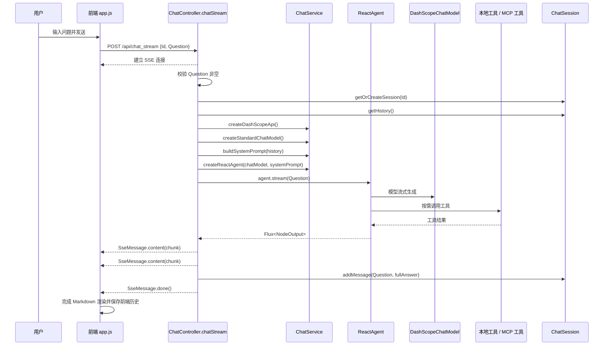

# OpsMind 流式聊天链路

更新时间：2026-07-09

本文描述 OpsMind 当前实现中的流式聊天链路，范围限定为：

> 前端在“流式对话”模式下调用 `POST /api/chat_stream`，后端创建 DashScope 模型和 `ReactAgent`，通过 `agent.stream(...)` 获取模型增量输出，并使用 SSE 将内容实时推送给前端。

它不同于：

- `/api/chat`：普通聊天链路，等待完整回答后一次性返回 JSON。
- `/api/ai_ops`：AIOps 多 Agent 告警诊断链路。
- `/api/upload -> Milvus`：文件上传和向量化链路。

## 1. 链路目标

流式聊天链路的目标是改善长回答和工具问答的交互体验，让用户在模型生成过程中实时看到内容。

它支持：

1. 普通自然语言问答。
2. 基于内存会话历史的上下文回答。
3. 本地 Java `@Tool` 工具调用。
4. 外部 MCP 工具调用。
5. 模型输出边生成边返回。
6. 流式完成后保存完整问答历史。

流式聊天不是一次性 JSON 响应，而是基于 `text/event-stream` 的 SSE 长连接。

## 2. 入口与关键代码

| 层次 | 文件 | 关键对象 / 方法 | 职责 |
|---|---|---|---|
| 前端 | `src/main/resources/static/app.js` | `sendStreamMessage(message)` | 调用 `/api/chat_stream`，读取 SSE 并实时渲染 |
| API | `src/main/java/org/example/controller/ChatController.java` | `chatStream(@RequestBody ChatRequest request)` | 创建 `SseEmitter`，异步执行流式 Agent |
| API | `src/main/java/org/example/controller/ChatController.java` | `handleStreamingOutput(...)` | 解析 `NodeOutput`，把模型增量转成 SSE |
| API | `src/main/java/org/example/controller/ChatController.java` | `handleStreamingComplete(...)` | 保存完整回答，发送 `done` |
| API | `src/main/java/org/example/controller/ChatController.java` | `handleStreamingError(...)` | 发送错误 SSE 并结束连接 |
| 服务 | `src/main/java/org/example/service/ChatService.java` | `createStandardChatModel(...)` | 创建普通聊天模型 |
| 服务 | `src/main/java/org/example/service/ChatService.java` | `buildSystemPrompt(history)` | 构造包含历史和工具说明的系统提示词 |
| 服务 | `src/main/java/org/example/service/ChatService.java` | `createReactAgent(...)` | 创建带本地工具和 MCP 工具的 `ReactAgent` |
| 消息 | `src/main/java/org/example/domain/vo/SseMessage.java` | `content` / `error` / `done` | 统一封装 SSE 数据格式 |

## 3. 端到端时序



### 3.1 完整链路压缩版

本节只保留流式聊天端到端主线，避免和后续章节重复。详细实现分别见 `## 4` 到后续章节。

完整链路可以压缩为：

```text
前端发送流式聊天消息
    -> sendStreamMessage(message)
    -> 前端添加用户消息和流式回答占位
    -> POST /api/chat_stream，提交 Id 和 Question
    -> ChatController.chatStream 接收 ChatRequest
    -> ChatController 创建 SseEmitter
    -> ChatController 在线程池中异步执行流式任务
    -> ChatController 校验 Question 非空
    -> ChatController 根据 Id 获取或创建 ChatSession
    -> ChatController 读取当前会话历史 history
    -> ChatService 创建 DashScopeApi
    -> ChatService 创建普通 DashScopeChatModel
    -> ChatService 根据 history 构造 systemPrompt
    -> ChatService 创建 ReactAgent
    -> ReactAgent.stream(question) 启动流式执行
    -> 大模型开始流式生成
    -> ReactAgent 按需调用本地工具或 MCP 工具
    -> 工具结果返回给 ReactAgent
    -> ReactAgent 持续产出 Flux<NodeOutput>
    -> ChatController.handleStreamingOutput 解析 NodeOutput
    -> ChatController 把增量文本封装为 SseMessage.content(chunk)
    -> 后端通过 SSE 持续推送 chunk 给前端
    -> 前端读取 response.body stream
    -> 前端按 SSE 格式解析 data 行
    -> 前端把 content 增量追加到回答区域
    -> 流结束后 ChatController 保存完整问答到 ChatSession
    -> ChatController 发送 SseMessage.done()
    -> 前端收到 done 后结束流式渲染
```

## 4. 前端触发

流式聊天由 `sendStreamMessage(message)` 触发：

```javascript
const response = await fetch(`${this.apiBaseUrl}/chat_stream`, {
  method: 'POST',
  headers: {
    'Content-Type': 'application/json',
  },
  body: JSON.stringify({
    Id: this.sessionId,
    Question: message
  })
});
```

请求体字段与普通聊天一致：

| 字段 | 含义 |
|---|---|
| `Id` | 当前前端会话 ID |
| `Question` | 用户输入的问题 |

后端 DTO `ChatRequest` 兼容 `Id` / `id` / `ID` 和 `Question` / `question` / `QUESTION`。

前端收到响应后，不调用 `response.json()`，而是读取流：

```javascript
const reader = response.body.getReader();
const decoder = new TextDecoder();
```

然后循环读取二进制 chunk，解码并按 SSE 行格式解析。

## 5. 后端 API 流程

入口方法是：

```java
@PostMapping(value = "/chat_stream", produces = "text/event-stream;charset=UTF-8")
public SseEmitter chatStream(@RequestBody ChatRequest request)
```

主要步骤：

1. 创建超时时间为 5 分钟的 `SseEmitter`。
2. 校验 `request.getQuestion()` 非空。
3. 如果问题为空，发送 `SseMessage.error("问题内容不能为空")` 并结束连接。
4. 在线程池中异步执行流式聊天任务。
5. 获取或创建 `ChatSession`。
6. 获取会话历史。
7. 创建 DashScope API 和标准 ChatModel。
8. 记录可用 MCP 工具。
9. 构建包含历史消息的 system prompt。
10. 创建带工具的 `ReactAgent`。
11. 调用 `agent.stream(request.getQuestion())`。
12. 订阅 `Flux<NodeOutput>`。
13. 将模型增量输出通过 SSE 发送给前端。
14. 流完成后保存完整回答到会话历史。
15. 发送 `SseMessage.done()` 并完成连接。

`SseEmitter` 创建代码：

```java
SseEmitter emitter = new SseEmitter(300000L);
```

`300000L` 表示最长保持 5 分钟。

实际流式处理在异步线程中执行：

```java
executor.execute(() -> {
    ...
});
```

这避免 Controller 请求线程被整个模型生成过程长期占用。

## 6. 模型、Prompt 和工具

流式聊天和普通聊天使用同一套 `ChatService` 能力。

模型创建：

```java
DashScopeChatModel chatModel = chatService.createStandardChatModel(dashScopeApi);
```

标准配置是：

```java
createChatModel(dashScopeApi, 0.7, 2000, 0.9)
```

系统提示词来自：

```java
String systemPrompt = chatService.buildSystemPrompt(history);
```

它包含：

- OpsMind 智能运维助手角色说明。
- 时间查询工具说明。
- 内部知识库检索工具说明。
- Prometheus 告警查询工具说明。
- 腾讯云日志 MCP 查询说明。
- 最近若干轮会话历史。

Agent 创建：

```java
ReactAgent agent = chatService.createReactAgent(chatModel, systemPrompt);
```

该 Agent 会注入两类工具：

```java
.methodTools(buildMethodToolsArray())
.tools(getToolCallbacks())
```

本地 method tools 包括：

- `DateTimeTools`：查询当前日期和时间。
- `InternalDocsTools`：检索内部知识库。
- `QueryMetricsTools`：通过 Prometheus 查询活跃告警信息。
- `QueryLogsTools`：根据告警或用户需求查询对应服务日志信息。

MCP tools 来自 `ToolCallbackProvider`。如果 MCP 未启用，返回空数组。

## 7. Agent 流式执行

流式聊天的核心调用是：

```java
Flux<NodeOutput> stream = agent.stream(request.getQuestion());
```

`stream` 本质上是一个**事件流**，吐出的是一个个代表 Agent 最新执行状态和生成内容的 `NodeOutput` 对象。此时还未开始“吐”内容。

然后订阅：

```java
stream.subscribe(
    output -> handleStreamingOutput(output, fullAnswerBuilder, emitter),
    error -> handleStreamingError(error, emitter),
    () -> handleStreamingComplete(request, session, fullAnswerBuilder, emitter)
);
```

订阅时才会开始“吐”内容。

三个回调分别对应：

| 回调 | 触发时机 | 处理逻辑 |
|---|---|---|
| `handleStreamingOutput` | 每次 Agent 输出节点 | 解析增量内容，发送 SSE |
| `handleStreamingError` | 流执行异常 | 发送错误 SSE，结束连接 |
| `handleStreamingComplete` | 流正常结束 | 保存完整回答，发送 done |

`fullAnswerBuilder` 用于累积完整回答：

```java
StringBuilder fullAnswerBuilder = new StringBuilder();
```

也就是说，后端既把增量 chunk 实时推给前端，也在内存里拼出完整答案，用于流结束后写入 `ChatSession`。

## 8. NodeOutput 处理

`handleStreamingOutput(...)` 只对 `StreamingOutput` 做处理：

```java
if (output instanceof StreamingOutput streamingOutput) {
    OutputType type = streamingOutput.getOutputType();
    ...
}
```

当前关注的输出类型包括：

| `OutputType` | 当前处理方式 |
|---|---|
| `AGENT_MODEL_STREAMING` | 当前这一瞬间生成的文本增量，取 `streamingOutput.message().getText()`，追加到完整回答并发送给前端 |
| `AGENT_MODEL_FINISHED` | 通常包含生成完毕的元数据（如统计 Token 数量、完成原因等），此时仅记录日志“模型输出完成” |
| `AGENT_TOOL_FINISHED` | 调用工具完成的相关信息，仅记录日志“工具调用完成” |
| `AGENT_HOOK_FINISHED` | 智能体钩子/生命周期回调完成的相关信息，仅记录 debug 日志 |

真正发给前端的内容来自：

```java
String chunk = streamingOutput.message().getText();
```

如果 chunk 非空：

```java
fullAnswerBuilder.append(chunk);
emitter.send(SseEmitter.event().name("message")
    .data(SseMessage.content(chunk), MediaType.APPLICATION_JSON));
```

因此前端只直接看到模型文本增量，不会直接看到 `AGENT_TOOL_FINISHED` 这类框架事件。

## 9. SSE 消息格式

后端统一使用 SSE 事件名：

```text
message
```

真正的业务类型在 JSON 数据里：

```java
SseMessage.content(chunk)
SseMessage.error(errorMessage)
SseMessage.done()
```

对应 JSON 形态：

```json
{
  "type": "content",
  "data": "模型增量文本"
}
```

```json
{
  "type": "error",
  "data": "错误信息"
}
```

```json
{
  "type": "done",
  "data": null
}
```

这也是前端代码里注释“后端统一使用 message 事件名，真正的类型在 data 的 JSON 中”的原因。

例子：

```json
// 正常结束
event: message
data: {"type":"content","data":"运"}

event: message
data: {"type":"content","data":"行"}

event: message
data: {"type":"content","data":"正"}

event: message
data: {"type":"content","data":"常"}

event: message
data: {"type":"done","data":null}

// 发生异常
event: message
data: {"type":"content","data":"正在为您读取告警...\n"}

event: message
data: {"type":"error","data":"Prometheus connection timeout: connection refused"}
```

## 10. 前端 SSE 解析

前端读取 `response.body.getReader()` 后，会维护一个缓冲区：

```javascript
let buffer = '';
let currentEvent = '';
```

每次读取后：

1. 使用 `TextDecoder` 解码。
2. 按 `\n` 拆分 SSE 行。
3. 保留最后一行未完成内容到 `buffer`。
4. 解析 `event:` 行。
5. 解析 `data:` 行。
6. 将 `data` 解析为 `SseMessage` JSON。

当收到：

```json
{"type":"content","data":"..."}
```

前端会：

```javascript
fullResponse += content;
messageContent.innerHTML = this.renderMarkdown(fullResponse);
this.highlightCodeBlocks(messageContent);
this.scrollToBottom();
```

所以前端不是把每个 chunk 直接作为纯文本追加到 DOM，而是每次基于当前 `fullResponse` 重新渲染 Markdown。

当收到：

```json
{"type":"done","data":null}
```

前端调用：

```javascript
this.handleStreamComplete(assistantMessageElement, fullResponse);
```

当收到：

```json
{"type":"error","data":"..."}
```

前端将消息内容渲染为：

```text
错误: ...
```

并结束本次流处理。

## 11. 流完成后的保存

后端流完成时执行：

```java
handleStreamingComplete(request, session, fullAnswerBuilder, emitter)
```

核心逻辑是：

```java
String fullAnswer = fullAnswerBuilder.toString();
session.addMessage(request.getQuestion(), fullAnswer);

emitter.send(SseEmitter.event().name("message")
    .data(SseMessage.done(), MediaType.APPLICATION_JSON));
emitter.complete();
```

也就是说，后端不会每收到一个 chunk 就更新会话历史，而是在流式输出全部完成后，把完整问答作为一轮历史写入 `ChatSession`。

前端也会在 `handleStreamComplete(...)` 中把完整助手回答写入当前浏览器侧历史：

```javascript
this.currentChatHistory.push({
    type: 'assistant',
    content: fullResponse,
    timestamp: new Date().toISOString()
});
```

## 12. 异常路径

### 12.1 请求问题为空

如果 `Question` 为空，后端立即发送：

```java
SseMessage.error("问题内容不能为空")
```

然后：

```java
emitter.complete();
```

### 12.2 初始化失败

如果创建模型、构建 Agent 或调用 `agent.stream(...)` 前发生异常，Controller 会发送：

```java
SseMessage.error(e.getMessage())
```

然后调用：

```java
completeWithErrorQuietly(emitter, e)
```

### 12.3 流执行失败

如果 `Flux<NodeOutput>` 在订阅过程中报错，会进入：

```java
handleStreamingError(error, emitter)
```

该方法会尝试发送错误 SSE，然后结束连接。

### 12.4 SSE 发送失败或客户端断连

如果客户端关闭页面、网络断开或代理中断，`emitter.send(...)` 可能失败。当前实现会记录日志并通过 `completeWithErrorQuietly(...)` 尝试结束连接。

## 13. 和普通聊天的区别

| 对比项 | 普通聊天 `/api/chat` | 流式聊天 `/api/chat_stream` |
|---|---|---|
| HTTP 形式 | 普通 JSON 请求/响应 | SSE 长连接 |
| 后端入口 | `chat(...)` | `chatStream(...)` |
| Agent 调用 | `agent.call(question)` | `agent.stream(question)` |
| 返回时机 | 完整回答生成后一次性返回 | 模型边生成边推送 |
| 前端读取方式 | `response.json()` | `response.body.getReader()` |
| 前端展示 | 一次性添加 assistant 消息 | 实时更新同一个 assistant 消息 |
| 会话保存 | 回答完成后保存 | 流完成后保存完整回答 |
| 错误格式 | `ApiResponse<ChatResponse>` | `SseMessage.error(...)` |

## 14. 当前实现边界

### 14.1 会话仍然只在内存中

流式聊天和普通聊天共用 `ChatController.sessions`。服务重启或多实例部署都会导致历史不一致或丢失。

### 14.2 后端超时时间固定为 5 分钟

`SseEmitter(300000L)` 固定为 5 分钟。长回答、慢工具调用或网络抖动可能导致连接超时。

### 14.3 工具事件没有推给前端

当前前端只接收模型文本增量。`AGENT_TOOL_FINISHED` 只写日志，不会作为“正在调用工具 / 工具完成”的进度消息展示。

### 14.4 前端反复重渲染 Markdown

每收到一个 chunk，前端都会用完整 `fullResponse` 重新渲染 Markdown。回答很长时可能带来一定性能压力。

### 14.5 错误后前端不一定保存失败状态

收到 `SseMessage.error(...)` 后，前端会显示错误文本并 return，但不会像正常完成一样调用 `handleStreamComplete(...)` 保存一条完整助手消息。

### 14.6 服务端订阅没有显式取消机制

客户端断连后，`SseEmitter` 发送会失败，但当前代码没有显式保存并取消 `Flux` subscription。需要关注长连接中断后的资源释放行为。

## 15. 一句话总结

流式聊天链路是：

> 前端调用 `/api/chat_stream` 建立 SSE 长连接，后端创建带工具的 `ReactAgent` 并调用 `agent.stream(question)`，将 `AGENT_MODEL_STREAMING` 的文本增量包装成 `SseMessage.content` 实时推送给前端，流结束后保存完整问答历史并发送 `SseMessage.done`。

## 16. 读代码建议顺序

1. `src/main/resources/static/app.js`
2. `src/main/java/org/example/controller/ChatController.java`
3. `src/main/java/org/example/domain/vo/SseMessage.java`
4. `src/main/java/org/example/service/ChatService.java`
5. `src/main/java/org/example/domain/dto/ChatRequest.java`
6. `src/main/java/org/example/domain/po/ChatSession.java`
7. `src/main/java/org/example/agent/tool/DateTimeTools.java`
8. `src/main/java/org/example/agent/tool/InternalDocsTools.java`
9. `src/main/java/org/example/agent/tool/QueryMetricsTools.java`
10. `src/main/java/org/example/agent/tool/QueryLogsTools.java`
