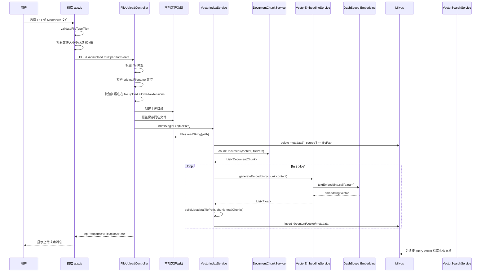
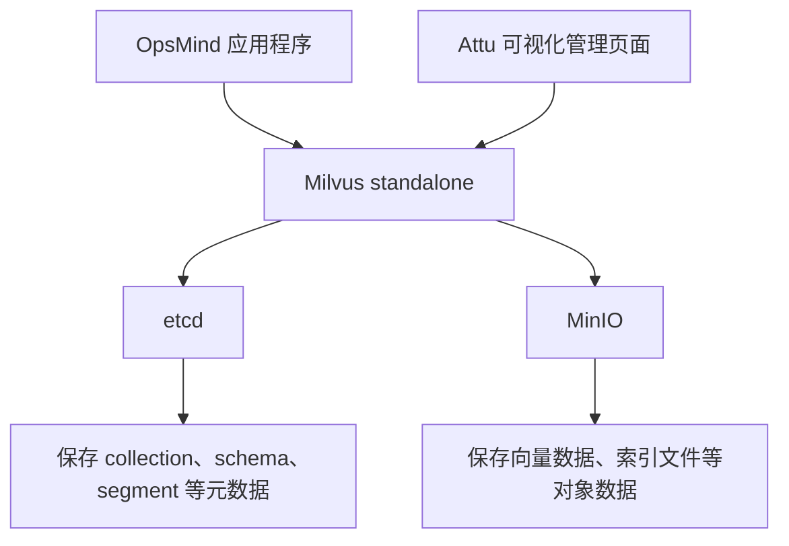
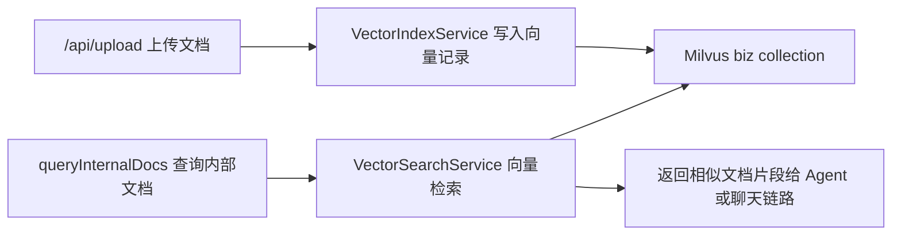

# OpsMind 文件上传和向量化链路

更新时间：2026-07-09

本文描述 OpsMind 当前实现中的文件上传和向量化链路，范围限定为：

> 前端上传 TXT / Markdown 文档到 `POST /api/upload`，后端保存文件到本地 `uploads` 目录，并同步触发文档分片、DashScope Embedding 向量化、Milvus 写入，最终让这些文档可以被内部文档 RAG 查询链路检索。

它不同于：

- `/api/chat`：普通聊天链路，面向一次性阻塞式问答。
- `/api/chat_stream`：流式聊天链路，面向 SSE 增量输出。
- `/api/ai_ops`：AIOps 多 Agent 告警诊断链路。
- `queryInternalDocs -> VectorSearchService`：内部文档 RAG 查询链路，负责检索 Milvus 中已经写入的向量记录。

## 1. 链路目标

文件上传和向量化链路的目标是把用户上传的运维文档、Runbook、故障处理手册等文本资料接入内部知识库。

它做了几件事：

1. 前端选择本地文件并校验格式。
2. 前端通过 `multipart/form-data` 调用 `/api/upload`。
3. 后端校验文件、文件名和扩展名。
4. 后端把文件保存到本地上传目录。
5. 上传成功后，后端读取文件内容。
6. 后端删除该文件在 Milvus 中的旧向量记录，避免重复写入。
7. 后端按标题、段落和重叠窗口切分文档。
8. 后端调用 DashScope Embedding API，把每个文档分片转成向量。
9. 后端把原文分片、向量和元数据写入 Milvus 的 `biz` collection。
10. 后续 RAG 查询时，系统可以从 Milvus 中召回这些文档片段。

需要特别注意：当前实现中，“上传成功”和“向量化入库成功”不是严格绑定的。`FileUploadController` 会在文件保存成功后尝试执行向量化入库流程，但如果入库失败，只记录日志，不会让上传接口失败。因此前端显示“上传到知识库成功”时，严格说只能确定文件上传接口返回成功，不能 100% 证明 Milvus 写入也成功。

## 2. 入口与关键代码

| 层次 | 文件 | 关键对象 / 方法 | 职责 |
|---|---|---|---|
| 前端 | `src/main/resources/static/app.js` | `handleFileSelect(event)` | 读取用户选择的文件，并触发上传 |
| 前端 | `src/main/resources/static/app.js` | `validateFileType(file)` | 校验前端允许的文件后缀 |
| 前端 | `src/main/resources/static/app.js` | `uploadFile(file)` | 构造 `FormData`，调用 `/api/upload` |
| API | `src/main/java/org/example/controller/FileUploadController.java` | `upload(@RequestParam("file") MultipartFile file)` | 接收文件、校验、保存，并触发向量化入库 |
| 配置 | `src/main/java/org/example/config/FileUploadConfig.java` | `file.upload.*` | 读取上传目录和允许扩展名 |
| 向量入库 | `src/main/java/org/example/service/VectorIndexService.java` | `indexSingleFile(filePath)` | 读取单个文件并完成向量化入库 |
| 分片 | `src/main/java/org/example/service/DocumentChunkService.java` | `chunkDocument(content, filePath)` | 把长文档切成多个 `DocumentChunk` |
| 向量化 | `src/main/java/org/example/service/VectorEmbeddingService.java` | `generateEmbedding(content)` | 调用 DashScope Embedding API 生成向量 |
| Milvus | `src/main/java/org/example/client/MilvusClientFactory.java` | `createClient()` | 连接 Milvus，并创建 collection 和索引 |
| 常量 | `src/main/java/org/example/constant/MilvusConstants.java` | `MILVUS_COLLECTION_NAME` / `VECTOR_DIM` | 定义 collection 名称和向量维度 |
| 数据 | `src/main/java/org/example/domain/po/DocumentChunk.java` | `DocumentChunk` | 表示一个文档分片 |
| 数据 | `src/main/java/org/example/domain/po/DocumentMetadata.java` | `DocumentMetadata` | 表示写入 Milvus 的文档元数据 |
| 响应 | `src/main/java/org/example/domain/vo/FileUploadRes.java` | `FileUploadRes` | 返回文件名、保存路径和文件大小 |

## 3. 端到端时序



### 3.1 完整链路压缩版

本节只保留文件上传和向量化端到端主线，避免和后续章节重复。详细实现分别见 `## 4` 到后续章节。

完整链路可以压缩为：

```text
前端选择 TXT / Markdown 文件
    -> handleFileSelect(event) 读取 file
    -> validateFileType(file) 校验文件后缀
    -> uploadFile(file) 二次校验文件后缀
    -> 前端校验文件大小不超过 50MB
    -> 前端创建 FormData，并 append("file", file)
    -> POST /api/upload，提交 multipart/form-data
    -> FileUploadController.upload 接收 MultipartFile
    -> 后端校验 file 非空
    -> 后端校验 originalFilename 非空
    -> 后端从文件名提取扩展名
    -> 后端根据 file.upload.allowed-extensions 校验扩展名
    -> 后端读取 file.upload.path，默认 ./uploads
    -> 后端创建上传目录
    -> 后端发现同名文件则删除旧文件
    -> 后端把上传文件保存到本地 filePath
    -> FileUploadController 调用 vectorIndexService.indexSingleFile(filePath)
    -> VectorIndexService 校验文件存在且是普通文件
    -> VectorIndexService 使用 Files.readString(path) 读取全文
    -> VectorIndexService 按 metadata["_source"] 删除 Milvus 旧向量记录
    -> DocumentChunkService.chunkDocument(content, filePath) 文档分片
    -> 每个 DocumentChunk 调用 VectorEmbeddingService.generateEmbedding(content)
    -> VectorEmbeddingService 调用 DashScope TextEmbedding API
    -> DashScope 返回 embedding vector
    -> VectorIndexService 构建 DocumentMetadata
    -> VectorIndexService 向 Milvus biz collection 插入 id/content/vector/metadata
    -> 所有分片写入完成后，indexSingleFile 返回
    -> FileUploadController 返回 ApiResponse<FileUploadRes>
    -> 前端显示“上传到知识库成功”
    -> 后续 InternalDocsTools / VectorSearchService 可从 Milvus 检索这些文档分片
```

## 4. 前端文件选择

文件上传从前端 `handleFileSelect(event)` 开始。用户选择文件后，前端取第一个文件：

```javascript
const file = event.target.files[0];
```

然后调用：

```javascript
this.validateFileType(file)
```

前端允许的扩展名是：

```javascript
const allowedExtensions = ['.txt', '.md', '.markdown'];
```

如果文件类型不符合要求，前端直接提示：

```javascript
this.showNotification('只支持上传 TXT 或 Markdown (.md) 格式的文件', 'error');
```

通过前端格式校验后，进入：

```javascript
this.uploadFile(file);
```

## 5. 前端上传请求

`uploadFile(file)` 会再次校验文件类型，这是前端侧的二次防护。

然后前端校验文件大小：

```javascript
const maxSize = 50 * 1024 * 1024;
if (file.size > maxSize) {
    this.showNotification('文件大小不能超过50MB', 'error');
    return;
}
```

当前 50MB 限制只在前端实现。后端 `FileUploadController` 没有对应的显式大小校验，实际后端限制还会受到 Spring Multipart 配置、网关或容器配置影响。

上传前，前端会锁定界面：

```javascript
this.isStreaming = true;
this.updateUI();
this.showUploadOverlay(true, file.name);
```

然后构造 `FormData`：

```javascript
const formData = new FormData();
formData.append('file', file);
```

最后请求：

```javascript
fetch(`${this.apiBaseUrl}/upload`, {
  method: 'POST',
  body: formData
})
```

这里没有手动设置 `Content-Type`，这是正确的做法。浏览器会自动生成 `multipart/form-data` 的 boundary。

## 6. 后端上传入口

后端入口是 `FileUploadController.upload(...)`：

```java
@PostMapping(value = "/api/upload", consumes = "multipart/form-data")
public ResponseEntity<?> upload(@RequestParam("file") MultipartFile file)
```

它要求表单字段名必须是：

```text
file
```

这和前端的：

```javascript
formData.append('file', file);
```

是一致的。

## 7. 后端上传校验

后端首先判断文件是否为空：

```java
if (file.isEmpty()) {
    return ResponseEntity.badRequest().body("文件不能为空");
}
```

然后取原始文件名：

```java
String originalFilename = file.getOriginalFilename();
```

如果文件名为空：

```java
return ResponseEntity.badRequest().body("文件名不能为空");
```

接着提取扩展名：

```java
String fileExtension = getFileExtension(originalFilename);
```

扩展名提取逻辑是取最后一个 `.` 后面的内容，并转小写。

然后调用：

```java
isAllowedExtension(fileExtension)
```

允许列表来自配置：

```yaml
file:
  upload:
    path: ./uploads
    allowed-extensions: txt,md
```

因此当前后端默认只允许：

```text
txt, md
```

这里和前端存在一个小不一致：前端允许 `.markdown`，但后端默认配置只允许 `txt,md`。所以 `.markdown` 文件会通过前端校验，但默认会被后端返回 400 拒绝。

## 8. 文件保存

通过校验后，后端读取上传目录：

```java
String uploadPath = fileUploadConfig.getPath();
Path uploadDir = Paths.get(uploadPath).normalize();
```

默认配置是：

```yaml
file:
  upload:
    path: ./uploads
```

如果目录不存在，创建目录：

```java
Files.createDirectories(uploadDir);
```

然后拼接目标文件路径：

```java
Path filePath = uploadDir.resolve(originalFilename).normalize();
```

如果同名文件已经存在，当前实现会先删除旧文件：

```java
if (Files.exists(filePath)) {
    Files.delete(filePath);
}
```

再保存新文件：

```java
Files.copy(file.getInputStream(), filePath);
```

所以当前语义是：同名上传会覆盖本地文件。

## 9. 触发文件向量化入库

文件保存成功后，后端马上触发该文件的向量化入库流程：

```java
vectorIndexService.indexSingleFile(filePath.toString());
```

这里的“向量化入库流程”指的是：读取文件内容、文档分片、生成 embedding 向量、构建元数据、写入 Milvus 向量记录。

它不是指 `IVF_FLAT / L2 / nlist=128` 这类 Milvus `vector` 字段索引结构。向量字段索引结构是在 collection 初始化时创建的；上传文件时只是往已有 collection 中删除旧向量记录并插入新向量记录。

这里有两个关键点：

1. 当前是同步调用，不是异步任务队列。
2. 向量化入库失败不会导致上传接口失败。

代码结构是：

```java
try {
    vectorIndexService.indexSingleFile(filePath.toString());
} catch (Exception e) {
    logger.error("文件向量化入库失败: {}, 错误: {}", filePath, e.getMessage(), e);
}
```

也就是说：

- 文件保存失败：接口返回 500。
- 文件保存成功、向量化入库成功：接口返回 200。
- 文件保存成功、向量化入库失败：接口仍返回 200，只在后端日志里记录错误。

这会带来一个现象：前端提示“上传到知识库成功”，但如果 DashScope、Milvus 或分片写入失败，后续 RAG 可能检索不到刚上传的文档。

## 10. 上传响应

上传接口成功时返回：

```java
FileUploadRes response = new FileUploadRes(
    originalFilename,
    filePath.toString(),
    file.getSize()
);

return ResponseEntity.ok(ApiResponse.success(response));
```

响应数据包含：

| 字段 | 含义 |
|---|---|
| `fileName` | 原始文件名 |
| `filePath` | 后端保存后的文件路径 |
| `fileSize` | 上传文件大小 |

前端判断：

```javascript
if ((data.code === 200 || data.message === 'success') && data.data) {
    const successMessage = `${file.name} 上传到知识库成功`;
    this.addMessage('assistant', successMessage, false, true);
}
```

这里的“知识库成功”是前端文案。以后如果希望更严谨，可以让后端响应中额外返回 `indexed: true/false` 或 `indexError`，区分“文件上传成功”和“向量化入库成功”。

## 11. VectorIndexService 主流程

向量化入库的核心入口是：

```java
public void indexSingleFile(String filePath) throws Exception
```

它的实际流程是：

1. 标准化文件路径。
2. 校验文件存在且是普通文件。
3. 使用 `Files.readString(path)` 读取全文。
4. 删除该文件在 Milvus 中的旧向量记录。
5. 调用 `DocumentChunkService` 做文档分片。
6. 遍历每个分片，生成向量。
7. 构建元数据。
8. 插入 Milvus。

对应代码结构：

```java
Path path = Paths.get(filePath).normalize();
File file = path.toFile();

if (!file.exists() || !file.isFile()) {
    throw new IllegalArgumentException("文件不存在: " + filePath);
}

String content = Files.readString(path);
deleteExistingData(path.toString());
List<DocumentChunk> chunks = chunkService.chunkDocument(content, path.toString());

for (DocumentChunk chunk : chunks) {
    List<Float> vector = embeddingService.generateEmbedding(chunk.getContent());
    DocumentMetadata metadata = buildMetadata(path.toString(), chunk, chunks.size());
    insertToMilvus(chunk.getContent(), vector, metadata, chunk.getChunkIndex());
}
```

## 12. 删除旧向量记录

为了避免同一个文件重复上传后产生重复文档分片记录，向量化入库前会先删除旧向量记录：

```java
deleteExistingData(path.toString());
```

删除依据是 Milvus 里 `metadata._source` 保存的文件路径。

路径会统一转换成 `/`：

```java
String normalizedPath = path.toString().replace(File.separator, "/");
```

删除表达式是：

```java
metadata["_source"] == "normalizedPath"
```

也就是按这个字段删：

```text
metadata["_source"]
```

删除前会先加载 collection：

```java
milvusClient.loadCollection(
    LoadCollectionParam.newBuilder()
        .withCollectionName(MilvusConstants.MILVUS_COLLECTION_NAME)
        .build()
);
```

当前 collection 名称是：

```java
public static final String MILVUS_COLLECTION_NAME = "biz";
```

如果删除旧向量记录失败，当前实现只打印 warn：

```java
logger.warn("删除旧数据失败（可能是首次索引）: {}", e.getMessage());
```

这意味着首次上传时删除失败不是问题；但如果是覆盖上传，删除失败可能导致新旧分片同时存在。

## 13. 文档分片策略

文档分片由 `DocumentChunkService.chunkDocument(content, filePath)` 完成。

配置来自：

```yaml
document:
  chunk:
    max-size: 800 # 字符数
    overlap: 100 # 新分片开始时，会拿上一个分片末尾最多 100 个字符放到新分片开头。
```

当前分片策略是：

1. 先按 Markdown 标题切章节。
2. 如果章节小于 `max-size`，整个章节作为一个分片。
3. 如果章节超过 `max-size`，再按段落切分。
4. 分片之间保留 `overlap` 个字符的重叠文本。如果上一个分片长度 < 100，就只能取整个上一个分片。
5. 重叠文本优先在中文句号、问号、感叹号处截断，尽量避免语义断裂。

Markdown 标题识别正则是：

```java
Pattern.compile("^(#{1,6})\\s+(.+)$", Pattern.MULTILINE)
```

也就是支持：

```markdown
# 一级标题
## 二级标题
### 三级标题
```

如果文档没有任何 Markdown 标题，就把整篇文档作为一个章节，再进入后续分片逻辑。

一个 `DocumentChunk` 大致包含：

| 字段 | 含义 |
|---|---|
| `content` | 分片文本 |
| `startIndex` | 分片在原文中的起始位置 |
| `endIndex` | 分片在原文中的结束位置 |
| `chunkIndex` | 全文中的分片序号 |
| `title` | 分片所属 Markdown 标题 |

## 14. DashScope Embedding 向量化

每个分片会调用：

```java
embeddingService.generateEmbedding(chunk.getContent());
```

`VectorEmbeddingService` 使用阿里云 DashScope 的 `TextEmbedding`：

```java
TextEmbeddingParam param = TextEmbeddingParam
    .builder()
    .model(model)
    .texts(Collections.singletonList(content))
    .build();

TextEmbeddingResult result = textEmbedding.call(param);
```

Embedding 模型来自配置：

```yaml
dashscope:
  embedding:
    model: text-embedding-v4
```

API Key 来自：

```yaml
dashscope:
  api:
    key: ${DASHSCOPE_API_KEY:your-api-key-here}
```

服务启动时，`VectorEmbeddingService.init()` 会校验 API Key：

```java
if (apiKey == null || apiKey.trim().isEmpty() || apiKey.equals("your-api-key-here")) {
    throw new IllegalStateException("请设置环境变量 DASHSCOPE_API_KEY 或在 application.yml 中配置正确的 API Key");
}
```

因此如果没有配置 `DASHSCOPE_API_KEY`，应用启动阶段就可能失败，而不是等到上传文件时才失败。

DashScope 返回的向量类型是 `List<Double>`，当前服务会转换成 `List<Float>`：

```java
for (Double value : embeddingDoubles) {
    floatEmbedding.add(value.floatValue());
}
```

Milvus 当前配置的向量维度是：

```java
public static final int VECTOR_DIM = 1024;
```

所以 `text-embedding-v4` 的实际输出维度必须和 `VECTOR_DIM` 匹配，否则 Milvus 插入会失败。

## 15. Milvus 初始化

Milvus 客户端由 `MilvusConfig` 创建，底层调用 `MilvusClientFactory.createClient()`。

连接配置来自：

```yaml
milvus:
  host: localhost
  port: 19530
  username: ""
  password: ""
  database: default
  timeout: 10000
```

创建客户端后，`MilvusClientFactory` 会检查 `biz` collection 是否存在。

如果不存在，会创建 collection：

```java
MilvusConstants.MILVUS_COLLECTION_NAME
```

当前值是：

```java
"biz"
```

### 15.1 Milvus 相关服务关系

当前项目的 `docker-compose.yml` 里，Milvus 不是单独一个容器就完成全部工作的，而是由几个服务一起组成向量数据库运行环境：

```text
Attu / 应用程序
        ↓
     Milvus
    ↓      ↓
  etcd    MinIO
 元数据   向量数据/索引文件
```

也可以理解为：



各服务职责如下：

| 服务 | docker-compose 服务名 / 容器名 | 作用 |
|---|---|---|
| Milvus | `standalone` / `milvus-standalone` | 核心向量数据库服务，对外提供 19530 端口，应用程序通过它创建 collection、写入向量、执行向量检索 |
| etcd | `etcd` / `milvus-etcd` | Milvus 的元数据存储，保存 collection 定义、字段 schema、segment 状态等管理信息 |
| MinIO | `minio` / `milvus-minio` | Milvus 的对象存储，保存向量数据、索引文件等底层数据文件 |
| Attu | `attu` / `milvus-attu` | Milvus 的 Web 可视化管理页面，用来查看 collection、数据、索引和连接状态 |

对应到当前项目：

1. OpsMind 后端通过 `milvus.host=localhost`、`milvus.port=19530` 连接 Milvus。
2. Milvus 自己再通过 `ETCD_ENDPOINTS=etcd:2379` 连接 etcd。
3. Milvus 自己再通过 `MINIO_ADDRESS=minio:9000` 连接 MinIO。
4. Attu 通过 `MILVUS_URL=standalone:19530` 连接 Milvus，并在宿主机暴露 `8000` 端口。

一句话总结：Milvus 是核心向量数据库，etcd 存元数据，MinIO 存向量数据和索引文件，Attu 是可视化管理页面；OpsMind 只直接连接 Milvus，不直接操作 etcd 或 MinIO。

### 15.2 各服务访问方式

当前项目里，OpsMind 应用本身不在 `docker-compose.yml` 里，通常是在本机直接启动；Milvus、etcd、MinIO、Attu、Prometheus 由 Docker Compose 启动。

从宿主机访问时：

| 服务 | 宿主机访问方式 | 用途 |
|---|---|---|
| OpsMind 应用 | `http://localhost:9900` | 访问项目前端页面和后端 API |
| 文件上传接口 | `POST http://localhost:9900/api/upload` | 上传文档并触发向量化入库 |
| Milvus | `localhost:19530` | 给 Java SDK、Attu 或其他 Milvus 客户端连接使用，不是浏览器页面 |
| Milvus 健康检查 | `http://localhost:9091/healthz` | 查看 Milvus standalone 是否健康 |
| Attu | `http://localhost:8000` | Milvus Web 可视化管理页面 |
| MinIO API | `http://localhost:9000` | MinIO 对象存储 API，Milvus 内部使用为主 |
| MinIO Console | `http://localhost:9001` | MinIO 管理页面，账号密码默认都是 `minioadmin` |
| Prometheus | `http://localhost:9090` | 查看 Prometheus 页面和查询指标 |
| etcd | 默认不暴露宿主机端口 | Milvus 内部元数据服务，通常不需要直接访问 |

从 Docker Compose 内部网络访问时：

| 服务 | 容器网络地址 | 说明 |
|---|---|---|
| Milvus | `standalone:19530` | Attu 通过 `MILVUS_URL=standalone:19530` 连接它 |
| etcd | `etcd:2379` | Milvus 通过 `ETCD_ENDPOINTS=etcd:2379` 连接它 |
| MinIO | `minio:9000` | Milvus 通过 `MINIO_ADDRESS=minio:9000` 连接它 |
| Prometheus | `prometheus:9090` | 如果后端也放进 Compose，Prometheus 地址应改成这个 |

几个容易混淆的点：

1. 浏览器看 Milvus 数据，应该访问 Attu：`http://localhost:8000`，不是 `localhost:19530`。
2. `localhost:19530` 是 Milvus SDK / 客户端连接地址，不是 HTTP 页面。
3. OpsMind 后端当前配置的是 `milvus.host=localhost`、`milvus.port=19530`，这适用于后端在宿主机运行、Milvus 在 Docker 中暴露端口的情况。
4. 如果以后把 OpsMind 后端也放进 Docker Compose，`milvus.host` 不能继续写 `localhost`，应该改成 Compose 服务名 `standalone`。
5. MinIO 是 Milvus 的底层对象存储，不建议手动删除里面的数据，否则可能破坏 Milvus 的向量数据和索引文件。
6. etcd 是 Milvus 的内部元数据存储，正常排查链路里一般不用直接访问。

## 16. Milvus Collection Schema

`biz` collection 的一条向量记录的字段包括：

| 字段 | 类型 | 说明 |
|---|---|---|
| `id` | `VarChar` | 主键，最大长度 256 |
| `vector` | `FloatVector` | 文档分片向量，维度 1024 |
| `content` | `VarChar` | 文档分片原文，最大长度 8192 |
| `metadata` | `JSON` | 文档元数据 |

Collection Schema 中用到的相关常量，创建 collection 时的一些配置值：

```java
public static final int VECTOR_DIM = 1024; // 向量维度
public static final int ID_MAX_LENGTH = 256; // 向量记录 ID 的最大长度
public static final int CONTENT_MAX_LENGTH = 8192; // 文档分片原文的最大长度
public static final int DEFAULT_SHARD_NUMBER = 2; // collection 默认 shard 数量
```

shard 就是 collection 的数据分片；`DEFAULT_SHARD_NUMBER = 2` 表示 Milvus 会把 `biz` collection 内部拆成 2 份来组织数据。

向量字段索引是：

| 配置 | 值 |
|---|---|
| `IndexType` | `IVF_FLAT` |
| `MetricType` | `L2` |
| `nlist` | `128` |

向量字段索引就是 Milvus 给 `vector` 字段建立的检索加速结构，用来更快找到和用户问题最相似的文档分片。

| 配置                   | 含义                              |
| ---------------------- | --------------------------------- |
| `IndexType = IVF_FLAT` | 使用 IVF_FLAT 这种向量索引算法    |
| `MetricType = L2`      | 用欧氏距离判断两个向量远近        |
| `nlist = 128`          | 把向量空间预先分成 128 个聚类区域 |

可以简单理解成：

```
没有索引：
从所有向量里逐个比较，慢。

有 IVF_FLAT 索引：
先把向量按相似程度分成 128 个区域。
查询时先判断问题向量大概落在哪些区域，再去这些区域里找相似向量。
```

## 17. Milvus 写入

每个文档分片都会插入一条记录。

写入前先加载 collection：

```java
milvusClient.loadCollection(
    LoadCollectionParam.newBuilder()
        .withCollectionName(MilvusConstants.MILVUS_COLLECTION_NAME)
        .build()
);
```

主键 `id` 是稳定生成的：

```java
String id = UUID.nameUUIDFromBytes((source + "_" + chunkIndex).getBytes()).toString();
```

这意味着同一个文件路径、同一个分片序号，会得到同一个 ID。

写入字段包括：

```java
fields.add(new InsertParam.Field("id", Collections.singletonList(id)));
fields.add(new InsertParam.Field("content", Collections.singletonList(content)));
fields.add(new InsertParam.Field("vector", Collections.singletonList(vector)));
fields.add(new InsertParam.Field("metadata", Collections.singletonList(metadataJson)));
```

最终执行：

```java
milvusClient.insert(insertParam);
```

如果 Milvus 返回状态不是 0，会抛出异常：

```java
throw new RuntimeException("插入向量失败: " + insertResponse.getMessage());
```

这个异常会从 `VectorIndexService.indexSingleFile(...)` 抛到 `FileUploadController`，然后被上传接口内部捕获并记录日志。

## 18. 元数据内容

每个分片写入 Milvus 时都会带上 `DocumentMetadata`。

当前元数据包含：

| 字段 | 含义 |
|---|---|
| `_source` | 标准化后的文件路径 |
| `_extension` | 文件扩展名 |
| `_file_name` | 文件名 |
| `chunkIndex` | 当前分片序号 |
| `totalChunks` | 当前文件总分片数 |
| `title` | 分片所属 Markdown 标题 |

其中 `_source` 很重要，因为删除旧向量记录时就是根据它做过滤：

```text
metadata["_source"] == "xxx"
```

后续 RAG 查询返回结果时，也可以用这些元数据展示文档来源。

## 19. 和 RAG 查询链路的关系

文件上传和向量化链路是“写入知识库”。

内部文档 RAG 查询链路是“读取知识库”。

两者通过 Milvus 连接起来：



上传链路写入的数据：

```text
content + vector + metadata
```

查询链路会把用户问题也转成 query vector，然后在 Milvus 中搜索相似的 `vector`，取回对应的 `content` 和 `metadata`。

因此，上传文档后能否被 RAG 查到，取决于：

1. 文件是否真的保存成功。
2. 文档是否成功分片。
3. 每个分片是否成功生成 embedding。
4. Milvus 是否成功写入。
5. 查询问题和文档片段在向量空间里是否足够相似。

## 20. 异常路径

### 20.1 前端校验失败

如果文件扩展名不是 `.txt`、`.md` 或 `.markdown`，前端不发请求，直接提示错误。

如果文件超过 50MB，前端不发请求，直接提示错误。

### 20.2 后端文件为空

`file.isEmpty()` 为 true 时返回：

```text
400 文件不能为空
```

### 20.3 后端文件名为空

`file.getOriginalFilename()` 为空时返回：

```text
400 文件名不能为空
```

### 20.4 后端扩展名不支持

如果扩展名不在 `file.upload.allowed-extensions` 中，返回：

```text
400 不支持的文件格式，仅支持: txt,md
```

### 20.5 文件保存失败

如果创建目录、删除旧文件或复制文件失败，返回：

```text
500 文件上传失败: ...
```

### 20.6 向量化入库失败

如果读取文件、删除旧向量记录、文档分片、DashScope 调用或 Milvus 插入失败：

1. `VectorIndexService` 抛异常。
2. `FileUploadController` 捕获异常。
3. 后端记录错误日志。
4. 上传接口仍返回成功响应。

这是当前实现最容易被误解的地方。

## 21. 当前实现边界

当前实现可以跑通基础的“上传文档并写入向量库”流程，但还有一些边界需要知道。

1. 向量化入库在上传请求线程中同步执行，大文件或大量分片会拉长 `/api/upload` 响应时间。
2. 向量化入库失败不会反映到接口响应中，前端无法知道 Milvus 是否真的写入成功。
3. 前端允许 `.markdown`，后端默认只允许 `txt,md`，两边配置不一致。
4. 前端有 50MB 文件大小限制，后端没有在 Controller 中显式校验同样的限制。
5. 当前使用 `Files.readString(path)` 读取文本文件，更适合纯文本和 Markdown，不适合 PDF、Word、Excel 等二进制文档。
6. 当前按 `originalFilename` 直接拼接保存路径，虽然做了 `normalize()`，但没有显式校验最终路径仍在上传目录下。
7. 同名文件上传会覆盖本地文件，并尝试按 `_source` 删除旧向量记录；删除失败时可能留下重复或过期分片。
8. Milvus 删除旧向量记录和插入新向量记录不是一个事务，中途失败可能出现“旧记录已删但新记录未完整写入”的状态。
9. 当前单分片逐个调用 `generateEmbedding(...)`，没有在上传链路里使用批量 embedding，文档分片较多时效率一般。
10. Milvus collection 的向量维度固定为 1024，Embedding 模型切换后必须同步确认维度。
11. 当前没有上传接口鉴权、用户隔离或租户隔离，所有上传内容写入同一个 `biz` collection。

## 22. 一句话总结

文件上传和向量化链路可以理解为：前端把文档传给 `/api/upload`，后端先把文件保存到 `uploads`，再把文件内容切成多个分片，每个分片调用 DashScope 生成 1024 维向量，最后把 `content + vector + metadata` 写入 Milvus 的 `biz` collection，供后续内部文档 RAG 查询使用。

## 23. 建议读代码顺序

如果要从代码角度跟完整链路，建议按这个顺序读：

1. `src/main/resources/static/app.js`：看 `handleFileSelect`、`validateFileType`、`uploadFile`。
2. `src/main/java/org/example/controller/FileUploadController.java`：看 `/api/upload` 如何保存文件和触发向量化入库。
3. `src/main/java/org/example/config/FileUploadConfig.java`：看上传目录和允许扩展名。
4. `src/main/java/org/example/service/VectorIndexService.java`：看单文件向量化入库主流程。
5. `src/main/java/org/example/service/DocumentChunkService.java`：看文档如何分片。
6. `src/main/java/org/example/service/VectorEmbeddingService.java`：看 DashScope Embedding 如何调用。
7. `src/main/java/org/example/client/MilvusClientFactory.java`：看 Milvus collection 和索引如何初始化。
8. `src/main/java/org/example/constant/MilvusConstants.java`：看 collection 名称、向量维度和字段限制。
9. `src/main/java/org/example/service/VectorSearchService.java`：看后续 RAG 查询如何消费这些向量数据。
